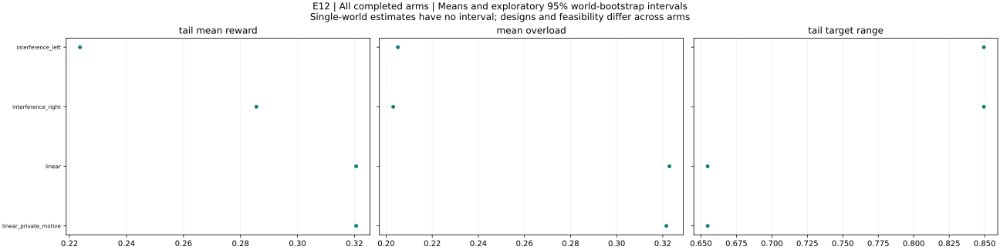

# RSI v0.4 — experimental research report

## Study scope and methods

This automatically generated report covers 4 valid completed runs across 4 arms. Coverage status: COMPLETE. Statistics first average nested replicas within each world, then weight independent worlds equally. Intervals are 95% percentile bootstrap intervals using 4,000 resamples and seed 4104. A single world has no uncertainty interval; fewer than ten worlds give fragile interval estimates. Intervals are exploratory and unadjusted for multiplicity. Missing values are excluded metric by metric, with denominators and missing counts reported. Settling times are conditional on observation; the settling-observed fraction reports censoring. Partial coverage can bias estimates, especially when failures depend on outcomes or nested replicas are missing. The older dashboard uses 90% intervals; this research bundle uses 95%.

## Limitations and interpretation

The report is a reproducible descriptive analysis, not an automatically completed scientific paper. Causal claims require suitable controls; pre/post intervention changes mix treatment effects with ongoing learning and changes of world. Finite trajectories do not prove convergence, periodicity or exhaustive basin coverage. Raw aggregate above a feasible benchmark may indicate overload. Multi-start nonconcave benchmarks are best found unless independently certified. Period-zero baselines and unequal horizons must be compared explicitly. No p-values, significance claims, automatic hypothesis acceptance, or fabricated literature citations are produced. Select primary contrasts before confirmatory runs and address multiplicity in the final paper.

## Coverage audit

- Planned: 4; valid complete: 4; missing: 0; invalid: 0; unexpected: 0.
- Full audit: `coverage_audit.json`. Source hashes: `report_manifest.json`.

## E12 — results and interpretation

All completed arms: world means and exploratory 95% bootstrap intervals. Single-world arms have no interval. Tail windows contain up to 20 observations. Compare configurations and feasibility before interpreting differences.

### interference_left

Example 4.7 left controlled start; finite-width learning variant

interference_left: 1 runs across 1 worlds. Final Y = 0.319007; final reward = 0.319007; mean overload = 0.20507. Tail target range = 0.849455; observed outcome-settling fraction = 0. Maximum eligible identification error (averaged over worlds) = 2.91767e-13. Some runs overload the budget; raw-Y efficiency comparisons require qualification. This arm has fewer than ten worlds; treat its pattern as exploratory.

Design flags: Identical deterministic seed replicas deduplicated

| Metric | Worlds | Mean | 95% interval |
|---|---:|---:|---|
| initial_Y | 1 | 0.337267 | not estimable to not estimable |
| final_Y | 1 | 0.319007 | not estimable to not estimable |
| final_reward | 1 | 0.319007 | not estimable to not estimable |
| improvement | 1 | -0.0182597 | not estimable to not estimable |
| gap_to_best_found | 1 | 0.337158 | not estimable to not estimable |
| settling_period | 0 | not estimable | not estimable to not estimable |
| total_overload | 1 | 61.7261 | not estimable to not estimable |
| skipped_turns | 1 | 0 | not estimable to not estimable |
| jump_events | 1 | 0 | not estimable to not estimable |
| bound_violations | 1 | 0 | not estimable to not estimable |
| tail_target_range | 1 | 0.849455 | not estimable to not estimable |
| target_path_length | 1 | 97.1765 | not estimable to not estimable |
| within_one_percent_best | 1 | 0 | not estimable to not estimable |
| mean_absolute_staleness | 1 | 0.3356 | not estimable to not estimable |
| max_curvature_fit_error | 1 | 1.73611e-13 | not estimable to not estimable |
| max_slope_fit_error | 1 | 2.91767e-13 | not estimable to not estimable |
| max_valid_identification_error | 1 | 2.91767e-13 | not estimable to not estimable |
| max_exploration_formula_error | 1 | 1.86125e-15 | not estimable to not estimable |
| mean_overload | 1 | 0.20507 | not estimable to not estimable |
| overload_period_fraction | 1 | 0.375415 | not estimable to not estimable |
| tail_mean_Y | 1 | 0.488115 | not estimable to not estimable |
| tail_mean_reward | 1 | 0.223683 | not estimable to not estimable |
| tail_price_range | 1 | 1000 | not estimable to not estimable |
| settling_observed | 1 | 0 | not estimable to not estimable |
| skip_fraction | 1 | 0 | not estimable to not estimable |
| eligible_fit_count | 1 | 300 | not estimable to not estimable |
| fit_count | 1 | 300 | not estimable to not estimable |
| max_complementarity_residual | 1 | 1403.44 | not estimable to not estimable |
| final_target_budget_excess | 1 | 0 | not estimable to not estimable |
| final_budget_feasible | 1 | 1 | not estimable to not estimable |
| global_certified | 1 | 0 | not estimable to not estimable |

Configuration: `{"config": {"T": 192, "a_max": 0.08, "beta": 0.7, "budget_rule": "price", "commit": "fixed", "curvature_floor": 0.05, "eps_dis": 0.02, "eta_p": 0.5, "frequencies": "nonresonant", "g0": 1.0, "initial_targets": [0.7768698398515702, 0.0], "k": 1, "lambda_overload": 1.0, "log_executions": false, "multistarts": 32, "non_disruption": "draft", "outside_cost_fraction": 0.3, "outside_kind": "none", "outside_local_gain": 0.3, "outside_period": 150, "outside_relocate": false, "outside_role": 0, "outside_scale": 0.4, "p_max": 1000.0, "p_min": 1e-08, "periods": 300, "phi_mem": 1.0, "price_tol": 1e-10, "rho_dis": 0.05, "schedule": "rotation", "theta_adj": 0.3, "w_min": 0.1, "within_period": "fixed"}, "world": {"alpha_max": 0.3, "budget_factor": 1.0, "n": 5, "s_off": 0.4, "scenario": "example2"}}`

### interference_right

Example 4.7 right controlled start; finite-width learning variant

interference_right: 1 runs across 1 worlds. Final Y = 0.590251; final reward = 0.40572; mean overload = 0.203067. Tail target range = 0.849455; observed outcome-settling fraction = 0. Maximum eligible identification error (averaged over worlds) = 3.02425e-13. Some runs overload the budget; raw-Y efficiency comparisons require qualification. This arm has fewer than ten worlds; treat its pattern as exploratory.

Design flags: Identical deterministic seed replicas deduplicated

| Metric | Worlds | Mean | 95% interval |
|---|---:|---:|---|
| initial_Y | 1 | 0.337267 | not estimable to not estimable |
| final_Y | 1 | 0.590251 | not estimable to not estimable |
| final_reward | 1 | 0.40572 | not estimable to not estimable |
| improvement | 1 | 0.252984 | not estimable to not estimable |
| gap_to_best_found | 1 | 0.0659138 | not estimable to not estimable |
| settling_period | 0 | not estimable | not estimable to not estimable |
| total_overload | 1 | 61.1232 | not estimable to not estimable |
| skipped_turns | 1 | 0 | not estimable to not estimable |
| jump_events | 1 | 0 | not estimable to not estimable |
| bound_violations | 1 | 0 | not estimable to not estimable |
| tail_target_range | 1 | 0.849455 | not estimable to not estimable |
| target_path_length | 1 | 96.4319 | not estimable to not estimable |
| within_one_percent_best | 1 | 0 | not estimable to not estimable |
| mean_absolute_staleness | 1 | 0.335164 | not estimable to not estimable |
| max_curvature_fit_error | 1 | 1.69281e-13 | not estimable to not estimable |
| max_slope_fit_error | 1 | 3.02425e-13 | not estimable to not estimable |
| max_valid_identification_error | 1 | 3.02425e-13 | not estimable to not estimable |
| max_exploration_formula_error | 1 | 1.86125e-15 | not estimable to not estimable |
| mean_overload | 1 | 0.203067 | not estimable to not estimable |
| overload_period_fraction | 1 | 0.372093 | not estimable to not estimable |
| tail_mean_Y | 1 | 0.459283 | not estimable to not estimable |
| tail_mean_reward | 1 | 0.285551 | not estimable to not estimable |
| tail_price_range | 1 | 1000 | not estimable to not estimable |
| settling_observed | 1 | 0 | not estimable to not estimable |
| skip_fraction | 1 | 0 | not estimable to not estimable |
| eligible_fit_count | 1 | 300 | not estimable to not estimable |
| fit_count | 1 | 300 | not estimable to not estimable |
| max_complementarity_residual | 1 | 1403.44 | not estimable to not estimable |
| final_target_budget_excess | 1 | 0.36713 | not estimable to not estimable |
| final_budget_feasible | 1 | 0 | not estimable to not estimable |
| global_certified | 1 | 0 | not estimable to not estimable |

Configuration: `{"config": {"T": 192, "a_max": 0.08, "beta": 0.7, "budget_rule": "price", "commit": "fixed", "curvature_floor": 0.05, "eps_dis": 0.02, "eta_p": 0.5, "frequencies": "nonresonant", "g0": 1.0, "initial_targets": [0.0, 0.7768698398515702], "k": 1, "lambda_overload": 1.0, "log_executions": false, "multistarts": 32, "non_disruption": "draft", "outside_cost_fraction": 0.3, "outside_kind": "none", "outside_local_gain": 0.3, "outside_period": 150, "outside_relocate": false, "outside_role": 0, "outside_scale": 0.4, "p_max": 1000.0, "p_min": 1e-08, "periods": 300, "phi_mem": 1.0, "price_tol": 1e-10, "rho_dis": 0.05, "schedule": "rotation", "theta_adj": 0.3, "w_min": 0.1, "within_period": "fixed"}, "world": {"alpha_max": 0.3, "budget_factor": 1.0, "n": 5, "s_off": 0.4, "scenario": "example2"}}`

### linear

Example 4.6

linear: 1 runs across 1 worlds. Final Y = 0.470853; final reward = 0.470853; mean overload = 0.322907. Tail target range = 0.654676; observed outcome-settling fraction = 0. Maximum eligible identification error (averaged over worlds) = 4.86722e-13. Some runs overload the budget; raw-Y efficiency comparisons require qualification. This arm has fewer than ten worlds; treat its pattern as exploratory.

Design flags: Identical deterministic seed replicas deduplicated

| Metric | Worlds | Mean | 95% interval |
|---|---:|---:|---|
| initial_Y | 1 | 0.948181 | not estimable to not estimable |
| final_Y | 1 | 0.470853 | not estimable to not estimable |
| final_reward | 1 | 0.470853 | not estimable to not estimable |
| improvement | 1 | -0.477328 | not estimable to not estimable |
| gap_to_best_found | 1 | 0.508887 | not estimable to not estimable |
| settling_period | 0 | not estimable | not estimable to not estimable |
| total_overload | 1 | 97.1951 | not estimable to not estimable |
| skipped_turns | 1 | 141 | not estimable to not estimable |
| jump_events | 1 | 0 | not estimable to not estimable |
| bound_violations | 1 | 0 | not estimable to not estimable |
| tail_target_range | 1 | 0.654676 | not estimable to not estimable |
| target_path_length | 1 | 68.867 | not estimable to not estimable |
| within_one_percent_best | 1 | 0 | not estimable to not estimable |
| mean_absolute_staleness | 1 | 0.00249169 | not estimable to not estimable |
| max_curvature_fit_error | 1 | 2.64545e-13 | not estimable to not estimable |
| max_slope_fit_error | 1 | 4.86722e-13 | not estimable to not estimable |
| max_valid_identification_error | 1 | 4.86722e-13 | not estimable to not estimable |
| max_exploration_formula_error | 1 | 2.77556e-15 | not estimable to not estimable |
| mean_overload | 1 | 0.322907 | not estimable to not estimable |
| overload_period_fraction | 1 | 0.33887 | not estimable to not estimable |
| tail_mean_Y | 1 | 0.615725 | not estimable to not estimable |
| tail_mean_reward | 1 | 0.320608 | not estimable to not estimable |
| tail_price_range | 1 | 1000 | not estimable to not estimable |
| settling_observed | 1 | 0 | not estimable to not estimable |
| skip_fraction | 1 | 0.47 | not estimable to not estimable |
| eligible_fit_count | 1 | 159 | not estimable to not estimable |
| fit_count | 1 | 159 | not estimable to not estimable |
| max_complementarity_residual | 1 | 1540.34 | not estimable to not estimable |
| final_target_budget_excess | 1 | 0 | not estimable to not estimable |
| final_budget_feasible | 1 | 1 | not estimable to not estimable |
| global_certified | 1 | 1 | not estimable to not estimable |

Configuration: `{"config": {"T": 192, "a_max": 0.08, "beta": 0.7, "budget_rule": "price", "commit": "fixed", "curvature_floor": 0.05, "eps_dis": 0.02, "eta_p": 0.5, "frequencies": "nonresonant", "g0": 1.0, "initial_targets": null, "k": 1, "lambda_overload": 1.0, "log_executions": false, "multistarts": 32, "non_disruption": "draft", "outside_cost_fraction": 0.3, "outside_kind": "none", "outside_local_gain": 0.3, "outside_period": 150, "outside_relocate": false, "outside_role": 0, "outside_scale": 0.4, "p_max": 1000.0, "p_min": 1e-08, "periods": 300, "phi_mem": 1.0, "price_tol": 1e-10, "rho_dis": 0.05, "schedule": "rotation", "theta_adj": 0.3, "w_min": 0.1, "within_period": "fixed"}, "world": {"alpha_max": 0.3, "budget_factor": 1.0, "n": 5, "s_off": 0.4, "scenario": "example1"}}`

### linear_private_motive

Example 5.11

linear_private_motive: 1 runs across 1 worlds. Final Y = 0.470854; final reward = 0.470854; mean overload = 0.321552. Tail target range = 0.654676; observed outcome-settling fraction = 0. Maximum eligible identification error (averaged over worlds) = 5.14699e-13. Some runs overload the budget; raw-Y efficiency comparisons require qualification. This arm has fewer than ten worlds; treat its pattern as exploratory.

Design flags: Identical deterministic seed replicas deduplicated

| Metric | Worlds | Mean | 95% interval |
|---|---:|---:|---|
| initial_Y | 1 | 0.899255 | not estimable to not estimable |
| final_Y | 1 | 0.470854 | not estimable to not estimable |
| final_reward | 1 | 0.470854 | not estimable to not estimable |
| improvement | 1 | -0.428401 | not estimable to not estimable |
| gap_to_best_found | 1 | 0.508886 | not estimable to not estimable |
| settling_period | 0 | not estimable | not estimable to not estimable |
| total_overload | 1 | 96.7873 | not estimable to not estimable |
| skipped_turns | 1 | 138 | not estimable to not estimable |
| jump_events | 1 | 0 | not estimable to not estimable |
| bound_violations | 1 | 0 | not estimable to not estimable |
| tail_target_range | 1 | 0.654676 | not estimable to not estimable |
| target_path_length | 1 | 70.1508 | not estimable to not estimable |
| within_one_percent_best | 1 | 0 | not estimable to not estimable |
| mean_absolute_staleness | 1 | 0.00249169 | not estimable to not estimable |
| max_curvature_fit_error | 1 | 2.79724e-13 | not estimable to not estimable |
| max_slope_fit_error | 1 | 5.14699e-13 | not estimable to not estimable |
| max_valid_identification_error | 1 | 5.14699e-13 | not estimable to not estimable |
| max_exploration_formula_error | 1 | 3.21965e-15 | not estimable to not estimable |
| mean_overload | 1 | 0.321552 | not estimable to not estimable |
| overload_period_fraction | 1 | 0.33887 | not estimable to not estimable |
| tail_mean_Y | 1 | 0.615726 | not estimable to not estimable |
| tail_mean_reward | 1 | 0.320609 | not estimable to not estimable |
| tail_price_range | 1 | 1000 | not estimable to not estimable |
| settling_observed | 1 | 0 | not estimable to not estimable |
| skip_fraction | 1 | 0.46 | not estimable to not estimable |
| eligible_fit_count | 1 | 162 | not estimable to not estimable |
| fit_count | 1 | 162 | not estimable to not estimable |
| max_complementarity_residual | 1 | 1540.34 | not estimable to not estimable |
| final_target_budget_excess | 1 | 0 | not estimable to not estimable |
| final_budget_feasible | 1 | 1 | not estimable to not estimable |
| global_certified | 1 | 1 | not estimable to not estimable |

Configuration: `{"config": {"T": 192, "a_max": 0.08, "beta": 0.7, "budget_rule": "price", "commit": "fixed", "curvature_floor": 0.05, "eps_dis": 0.02, "eta_p": 0.5, "frequencies": "nonresonant", "g0": 1.0, "initial_targets": null, "k": 1, "lambda_overload": 1.0, "log_executions": false, "multistarts": 32, "non_disruption": "draft", "outside_cost_fraction": 0.3, "outside_kind": "none", "outside_local_gain": 0.3, "outside_period": 150, "outside_relocate": false, "outside_role": 0, "outside_scale": 0.4, "p_max": 1000.0, "p_min": 1e-08, "periods": 300, "phi_mem": 1.0, "price_tol": 1e-10, "rho_dis": 0.05, "schedule": "rotation", "theta_adj": 0.3, "w_min": 0.1, "within_period": "fixed"}, "world": {"alpha_max": 0.3, "budget_factor": 1.0, "example_motive": 0.5, "n": 5, "s_off": 0.4, "scenario": "example1"}}`

## Explicit planned comparisons

No explicit contrasts supplied. Use --contrasts before interpreting treatment effects.

## Complete run appendix

- [E12/interference_left/0/0](runs/run-e07e8bd513c8c5e0.html)
- [E12/interference_right/0/0](runs/run-f2939a8a9c1bba7f.html)
- [E12/linear/0/0](runs/run-c4566246a108d727.html)
- [E12/linear_private_motive/0/0](runs/run-09d9f1ca0a35d2f2.html)

## Metric dictionary

- **final_Y**: Raw mean aggregate in the final period; may include infeasible executions.
- **final_reward**: Final aggregate minus the configured overload penalty.
- **improvement**: Final raw aggregate minus period-zero raw aggregate; not a causal treatment effect.
- **gap_to_best_found**: Feasible team best-found minus final raw aggregate. Negative values may reflect overload.
- **total_overload**: Sum of per-period overload; horizon dependent. Fixed periods use average-budget overload; adaptive periods average positive execution overload.
- **mean_overload**: Mean overload across all logged periods, including period zero.
- **overload_period_fraction**: Fraction of logged periods with overload above 1e-8.
- **tail_mean_Y**: Mean raw aggregate across the last min(20, number of observations) periods.
- **tail_mean_reward**: Mean penalized reward over the same final window.
- **tail_target_range**: Largest coordinate range over the last up to 20 periods. Finite-horizon motion diagnostic.
- **tail_price_range**: Maximum minus minimum price over the final up to 20 periods.
- **settling_period**: First period of a suffix of at least 20 observations within 1% of final Y. Null means not observed; conditional means exclude censored runs.
- **settling_observed**: 1 if the outcome settling criterion was observed, 0 otherwise; not a setting-convergence test.
- **skipped_turns**: Number of scheduled function turns not executed.
- **skip_fraction**: Skipped function turns / scheduled function turns; null if none scheduled.
- **jump_events**: Number of logged fast-game jump events.
- **bound_violations**: Number of execution-coordinate commitment-bound violations.
- **target_path_length**: Sum of Euclidean target displacements between periods.
- **mean_absolute_staleness**: Mean absolute local-slope belief error over functions and periods, including initial priors.
- **max_valid_identification_error**: Maximum absolute fitted slope/curvature error only on updates satisfying logged exact-identification conditions; null if no eligible fits.
- **eligible_fit_count**: Number of updates satisfying exact-identification conditions.
- **fit_count**: Number of successful local regression updates.
- **max_curvature_fit_error**: Largest absolute curvature-fit error over all updates, whether or not exact premises hold.
- **max_slope_fit_error**: Largest absolute slope-fit error over all updates.
- **max_exploration_formula_error**: Largest exploration-effect prediction error over periods with logged applicability.
- **max_complementarity_residual**: Largest logged resource price/complementarity residual.
- **final_target_budget_excess**: Positive part of final target spending minus the final world budget.
- **final_budget_feasible**: 1 if final logged mean spending is within budget +1e-8; average-feasibility diagnostic only.
- **within_one_percent_best**: Raw final Y within 1% of best-found Y; interpret jointly with feasibility.
- **global_certified**: 1 if final team benchmark carries the solver global-certification flag.
- **initial_Y**: Period-zero raw aggregate.
