# RSI v0.4 — experimental research report

## Study scope and methods

This automatically generated report covers 36 valid completed runs across 36 arms. Coverage status: COMPLETE. Statistics first average nested replicas within each world, then weight independent worlds equally. Intervals are 95% percentile bootstrap intervals using 4,000 resamples and seed 4104. A single world has no uncertainty interval; fewer than ten worlds give fragile interval estimates. Intervals are exploratory and unadjusted for multiplicity. Missing values are excluded metric by metric, with denominators and missing counts reported. Settling times are conditional on observation; the settling-observed fraction reports censoring. Partial coverage can bias estimates, especially when failures depend on outcomes or nested replicas are missing. The older dashboard uses 90% intervals; this research bundle uses 95%.

## Limitations and interpretation

The report is a reproducible descriptive analysis, not an automatically completed scientific paper. Causal claims require suitable controls; pre/post intervention changes mix treatment effects with ongoing learning and changes of world. Finite trajectories do not prove convergence, periodicity or exhaustive basin coverage. Raw aggregate above a feasible benchmark may indicate overload. Multi-start nonconcave benchmarks are best found unless independently certified. Period-zero baselines and unequal horizons must be compared explicitly. No p-values, significance claims, automatic hypothesis acceptance, or fabricated literature citations are produced. Select primary contrasts before confirmatory runs and address multiplicity in the final paper.

## Coverage audit

- Planned: 36; valid complete: 36; missing: 0; invalid: 0; unexpected: 0.
- Full audit: `coverage_audit.json`. Source hashes: `report_manifest.json`.

## E1 — results and interpretation

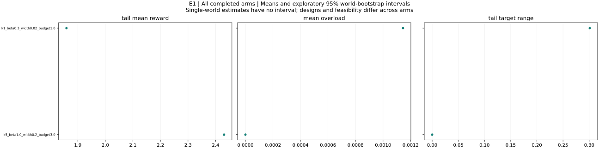

All completed arms: world means and exploratory 95% bootstrap intervals. Single-world arms have no interval. Tail windows contain up to 20 observations. Compare configurations and feasibility before interpreting differences.

### k1_beta0.3_width0.02_budget1.0

Binding versus slack budget convergence; width and damping

k1_beta0.3_width0.02_budget1.0: 1 runs across 1 worlds. Final Y = 1.84674; final reward = 1.84674; mean overload = 0.00114509. Tail target range = 0.30102; observed outcome-settling fraction = 0. Maximum eligible identification error (averaged over worlds) = 2.10942e-13. Some runs overload the budget; raw-Y efficiency comparisons require qualification. This arm has fewer than ten worlds; treat its pattern as exploratory.

Design flags: none

| Metric | Worlds | Mean | 95% interval |
|---|---:|---:|---|
| initial_Y | 1 | 1.72752 | not estimable to not estimable |
| final_Y | 1 | 1.84674 | not estimable to not estimable |
| final_reward | 1 | 1.84674 | not estimable to not estimable |
| improvement | 1 | 0.119215 | not estimable to not estimable |
| gap_to_best_found | 1 | 0.173885 | not estimable to not estimable |
| settling_period | 0 | not estimable | not estimable to not estimable |
| total_overload | 1 | 0.0148862 | not estimable to not estimable |
| skipped_turns | 1 | 0 | not estimable to not estimable |
| jump_events | 1 | 0 | not estimable to not estimable |
| bound_violations | 1 | 0 | not estimable to not estimable |
| tail_target_range | 1 | 0.30102 | not estimable to not estimable |
| target_path_length | 1 | 1.10424 | not estimable to not estimable |
| within_one_percent_best | 1 | 0 | not estimable to not estimable |
| mean_absolute_staleness | 1 | 0.192562 | not estimable to not estimable |
| max_curvature_fit_error | 1 | 1.83631e-13 | not estimable to not estimable |
| max_slope_fit_error | 1 | 2.10942e-13 | not estimable to not estimable |
| max_valid_identification_error | 1 | 2.10942e-13 | not estimable to not estimable |
| max_exploration_formula_error | 1 | 3.61777e-15 | not estimable to not estimable |
| mean_overload | 1 | 0.00114509 | not estimable to not estimable |
| overload_period_fraction | 1 | 0.0769231 | not estimable to not estimable |
| tail_mean_Y | 1 | 1.8601 | not estimable to not estimable |
| tail_mean_reward | 1 | 1.85895 | not estimable to not estimable |
| tail_price_range | 1 | 1000 | not estimable to not estimable |
| settling_observed | 1 | 0 | not estimable to not estimable |
| skip_fraction | 1 | 0 | not estimable to not estimable |
| eligible_fit_count | 1 | 12 | not estimable to not estimable |
| fit_count | 1 | 12 | not estimable to not estimable |
| max_complementarity_residual | 1 | 14.8862 | not estimable to not estimable |
| final_target_budget_excess | 1 | 0 | not estimable to not estimable |
| final_budget_feasible | 1 | 1 | not estimable to not estimable |
| global_certified | 1 | 1 | not estimable to not estimable |

Configuration: `{"config": {"T": 192, "a_max": 0.08, "beta": 0.3, "budget_rule": "price", "commit": "fixed", "curvature_floor": 0.05, "eps_dis": 0.02, "eta_p": 0.5, "frequencies": "nonresonant", "g0": 1.0, "initial_targets": null, "k": 1, "lambda_overload": 1.0, "log_executions": false, "multistarts": 8, "non_disruption": "draft", "outside_cost_fraction": 0.3, "outside_kind": "none", "outside_local_gain": 0.3, "outside_period": 150, "outside_relocate": false, "outside_role": 0, "outside_scale": 0.4, "p_max": 1000.0, "p_min": 1e-08, "periods": 12, "phi_mem": 1.0, "price_tol": 1e-10, "rho_dis": 0.05, "schedule": "rotation", "theta_adj": 0.3, "w_min": 0.02, "within_period": "fixed"}, "world": {"alpha_max": 0.3, "budget_factor": 1.0, "n": 5, "s_off": 0.4, "scenario": "concave"}}`

### k5_beta1.0_width0.2_budget3.0

Binding versus slack budget convergence; width and damping

k5_beta1.0_width0.2_budget3.0: 1 runs across 1 worlds. Final Y = 2.43078; final reward = 2.43078; mean overload = 0. Tail target range = 0; observed outcome-settling fraction = 0. Maximum eligible identification error (averaged over worlds) = not estimable. More than half of scheduled turns are skipped on average; effective exploration is limited. This arm has fewer than ten worlds; treat its pattern as exploratory.

Design flags: All scheduled turns necessarily skip: a_max < w_min/2; During all-explorer periods price cannot adjust any free setting

| Metric | Worlds | Mean | 95% interval |
|---|---:|---:|---|
| initial_Y | 1 | 2.43078 | not estimable to not estimable |
| final_Y | 1 | 2.43078 | not estimable to not estimable |
| final_reward | 1 | 2.43078 | not estimable to not estimable |
| improvement | 1 | 0 | not estimable to not estimable |
| gap_to_best_found | 1 | 0.305499 | not estimable to not estimable |
| settling_period | 0 | not estimable | not estimable to not estimable |
| total_overload | 1 | 0 | not estimable to not estimable |
| skipped_turns | 1 | 60 | not estimable to not estimable |
| jump_events | 1 | 0 | not estimable to not estimable |
| bound_violations | 1 | 0 | not estimable to not estimable |
| tail_target_range | 1 | 0 | not estimable to not estimable |
| target_path_length | 1 | 0 | not estimable to not estimable |
| within_one_percent_best | 1 | 0 | not estimable to not estimable |
| mean_absolute_staleness | 1 | 0.802516 | not estimable to not estimable |
| max_curvature_fit_error | 0 | not estimable | not estimable to not estimable |
| max_slope_fit_error | 0 | not estimable | not estimable to not estimable |
| max_valid_identification_error | 0 | not estimable | not estimable to not estimable |
| max_exploration_formula_error | 1 | 8.88178e-16 | not estimable to not estimable |
| mean_overload | 1 | 0 | not estimable to not estimable |
| overload_period_fraction | 1 | 0 | not estimable to not estimable |
| tail_mean_Y | 1 | 2.43078 | not estimable to not estimable |
| tail_mean_reward | 1 | 2.43078 | not estimable to not estimable |
| tail_price_range | 1 | 0 | not estimable to not estimable |
| settling_observed | 1 | 0 | not estimable to not estimable |
| skip_fraction | 1 | 1 | not estimable to not estimable |
| eligible_fit_count | 1 | 0 | not estimable to not estimable |
| fit_count | 1 | 0 | not estimable to not estimable |
| max_complementarity_residual | 1 | 2.21286e-10 | not estimable to not estimable |
| final_target_budget_excess | 1 | 0 | not estimable to not estimable |
| final_budget_feasible | 1 | 1 | not estimable to not estimable |
| global_certified | 1 | 1 | not estimable to not estimable |

Configuration: `{"config": {"T": 192, "a_max": 0.08, "beta": 1.0, "budget_rule": "price", "commit": "fixed", "curvature_floor": 0.05, "eps_dis": 0.02, "eta_p": 0.5, "frequencies": "nonresonant", "g0": 1.0, "initial_targets": null, "k": 5, "lambda_overload": 1.0, "log_executions": false, "multistarts": 8, "non_disruption": "draft", "outside_cost_fraction": 0.3, "outside_kind": "none", "outside_local_gain": 0.3, "outside_period": 150, "outside_relocate": false, "outside_role": 0, "outside_scale": 0.4, "p_max": 1000.0, "p_min": 1e-08, "periods": 12, "phi_mem": 1.0, "price_tol": 1e-10, "rho_dis": 0.05, "schedule": "rotation", "theta_adj": 0.3, "w_min": 0.2, "within_period": "fixed"}, "world": {"alpha_max": 0.3, "budget_factor": 3.0, "n": 5, "s_off": 0.4, "scenario": "concave"}}`

## E10 — results and interpretation

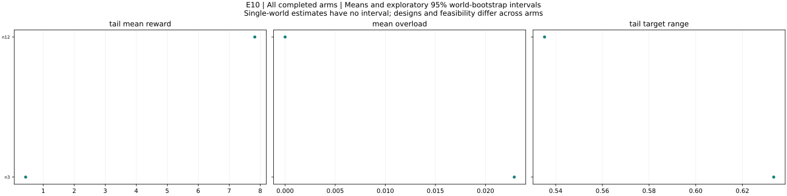

All completed arms: world means and exploratory 95% bootstrap intervals. Single-world arms have no interval. Tail windows contain up to 20 observations. Compare configurations and feasibility before interpreting differences.

### n12

Scale; T automatically respects the frequency constraint

n12: 1 runs across 1 worlds. Final Y = 9.74053; final reward = 9.74053; mean overload = 0. Tail target range = 0.535225; observed outcome-settling fraction = 0. Maximum eligible identification error (averaged over worlds) = 3.58602e-13. This arm has fewer than ten worlds; treat its pattern as exploratory.

Design flags: none

| Metric | Worlds | Mean | 95% interval |
|---|---:|---:|---|
| initial_Y | 1 | 5.32205 | not estimable to not estimable |
| final_Y | 1 | 9.74053 | not estimable to not estimable |
| final_reward | 1 | 9.74053 | not estimable to not estimable |
| improvement | 1 | 4.41849 | not estimable to not estimable |
| gap_to_best_found | 1 | 0.793122 | not estimable to not estimable |
| settling_period | 0 | not estimable | not estimable to not estimable |
| total_overload | 1 | 0 | not estimable to not estimable |
| skipped_turns | 1 | 0 | not estimable to not estimable |
| jump_events | 1 | 0 | not estimable to not estimable |
| bound_violations | 1 | 0 | not estimable to not estimable |
| tail_target_range | 1 | 0.535225 | not estimable to not estimable |
| target_path_length | 1 | 2.99842 | not estimable to not estimable |
| within_one_percent_best | 1 | 0 | not estimable to not estimable |
| mean_absolute_staleness | 1 | 1.05244 | not estimable to not estimable |
| max_curvature_fit_error | 1 | 3.1708e-13 | not estimable to not estimable |
| max_slope_fit_error | 1 | 3.58602e-13 | not estimable to not estimable |
| max_valid_identification_error | 1 | 3.58602e-13 | not estimable to not estimable |
| max_exploration_formula_error | 1 | 5.96453e-14 | not estimable to not estimable |
| mean_overload | 1 | 0 | not estimable to not estimable |
| overload_period_fraction | 1 | 0 | not estimable to not estimable |
| tail_mean_Y | 1 | 7.82599 | not estimable to not estimable |
| tail_mean_reward | 1 | 7.82599 | not estimable to not estimable |
| tail_price_range | 1 | 0.209943 | not estimable to not estimable |
| settling_observed | 1 | 0 | not estimable to not estimable |
| skip_fraction | 1 | 0 | not estimable to not estimable |
| eligible_fit_count | 1 | 12 | not estimable to not estimable |
| fit_count | 1 | 12 | not estimable to not estimable |
| max_complementarity_residual | 1 | 4.74414e-10 | not estimable to not estimable |
| final_target_budget_excess | 1 | 0 | not estimable to not estimable |
| final_budget_feasible | 1 | 1 | not estimable to not estimable |
| global_certified | 1 | 0 | not estimable to not estimable |

Configuration: `{"config": {"T": 192, "a_max": 0.08, "beta": 0.7, "budget_rule": "price", "commit": "fixed", "curvature_floor": 0.05, "eps_dis": 0.02, "eta_p": 0.5, "frequencies": "nonresonant", "g0": 1.0, "initial_targets": null, "k": 1, "lambda_overload": 1.0, "log_executions": false, "multistarts": 8, "non_disruption": "draft", "outside_cost_fraction": 0.3, "outside_kind": "none", "outside_local_gain": 0.3, "outside_period": 150, "outside_relocate": false, "outside_role": 0, "outside_scale": 0.4, "p_max": 1000.0, "p_min": 1e-08, "periods": 12, "phi_mem": 1.0, "price_tol": 1e-10, "rho_dis": 0.05, "schedule": "rotation", "theta_adj": 0.3, "w_min": 0.1, "within_period": "fixed"}, "world": {"alpha_max": 0.3, "budget_factor": 1.0, "n": 12, "s_off": 0.4, "scenario": "frustrated"}}`

### n3

Scale; T automatically respects the frequency constraint

n3: 1 runs across 1 worlds. Final Y = 0.444345; final reward = 0.444345; mean overload = 0.0228729. Tail target range = 0.633409; observed outcome-settling fraction = 0. Maximum eligible identification error (averaged over worlds) = 6.38378e-14. Some runs overload the budget; raw-Y efficiency comparisons require qualification. This arm has fewer than ten worlds; treat its pattern as exploratory.

Design flags: none

| Metric | Worlds | Mean | 95% interval |
|---|---:|---:|---|
| initial_Y | 1 | 0.308045 | not estimable to not estimable |
| final_Y | 1 | 0.444345 | not estimable to not estimable |
| final_reward | 1 | 0.444345 | not estimable to not estimable |
| improvement | 1 | 0.136301 | not estimable to not estimable |
| gap_to_best_found | 1 | 0.165119 | not estimable to not estimable |
| settling_period | 0 | not estimable | not estimable to not estimable |
| total_overload | 1 | 0.297348 | not estimable to not estimable |
| skipped_turns | 1 | 0 | not estimable to not estimable |
| jump_events | 1 | 0 | not estimable to not estimable |
| bound_violations | 1 | 0 | not estimable to not estimable |
| tail_target_range | 1 | 0.633409 | not estimable to not estimable |
| target_path_length | 1 | 2.96181 | not estimable to not estimable |
| within_one_percent_best | 1 | 0 | not estimable to not estimable |
| mean_absolute_staleness | 1 | 0.285775 | not estimable to not estimable |
| max_curvature_fit_error | 1 | 4.89608e-14 | not estimable to not estimable |
| max_slope_fit_error | 1 | 6.38378e-14 | not estimable to not estimable |
| max_valid_identification_error | 1 | 6.38378e-14 | not estimable to not estimable |
| max_exploration_formula_error | 1 | 7.21645e-16 | not estimable to not estimable |
| mean_overload | 1 | 0.0228729 | not estimable to not estimable |
| overload_period_fraction | 1 | 0.0769231 | not estimable to not estimable |
| tail_mean_Y | 1 | 0.455509 | not estimable to not estimable |
| tail_mean_reward | 1 | 0.432636 | not estimable to not estimable |
| tail_price_range | 1 | 1000 | not estimable to not estimable |
| settling_observed | 1 | 0 | not estimable to not estimable |
| skip_fraction | 1 | 0 | not estimable to not estimable |
| eligible_fit_count | 1 | 12 | not estimable to not estimable |
| fit_count | 1 | 12 | not estimable to not estimable |
| max_complementarity_residual | 1 | 297.348 | not estimable to not estimable |
| final_target_budget_excess | 1 | 0.291169 | not estimable to not estimable |
| final_budget_feasible | 1 | 1 | not estimable to not estimable |
| global_certified | 1 | 0 | not estimable to not estimable |

Configuration: `{"config": {"T": 192, "a_max": 0.08, "beta": 0.7, "budget_rule": "price", "commit": "fixed", "curvature_floor": 0.05, "eps_dis": 0.02, "eta_p": 0.5, "frequencies": "nonresonant", "g0": 1.0, "initial_targets": null, "k": 1, "lambda_overload": 1.0, "log_executions": false, "multistarts": 8, "non_disruption": "draft", "outside_cost_fraction": 0.3, "outside_kind": "none", "outside_local_gain": 0.3, "outside_period": 150, "outside_relocate": false, "outside_role": 0, "outside_scale": 0.4, "p_max": 1000.0, "p_min": 1e-08, "periods": 12, "phi_mem": 1.0, "price_tol": 1e-10, "rho_dis": 0.05, "schedule": "rotation", "theta_adj": 0.3, "w_min": 0.1, "within_period": "fixed"}, "world": {"alpha_max": 0.3, "budget_factor": 1.0, "n": 3, "s_off": 0.4, "scenario": "frustrated"}}`

## E11 — results and interpretation

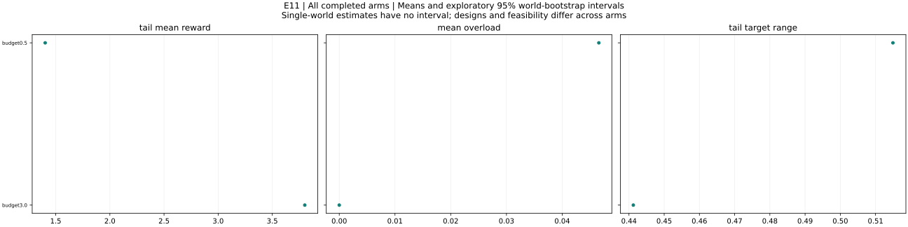

All completed arms: world means and exploratory 95% bootstrap intervals. Single-world arms have no interval. Tail windows contain up to 20 observations. Compare configurations and feasibility before interpreting differences.

### budget0.5

Budget tightness and distance-to-perfection pattern

budget0.5: 1 runs across 1 worlds. Final Y = 1.34047; final reward = 1.1492; mean overload = 0.0465755. Tail target range = 0.514937; observed outcome-settling fraction = 0. Maximum eligible identification error (averaged over worlds) = 1.91569e-13. Some runs overload the budget; raw-Y efficiency comparisons require qualification. This arm has fewer than ten worlds; treat its pattern as exploratory.

Design flags: none

| Metric | Worlds | Mean | 95% interval |
|---|---:|---:|---|
| initial_Y | 1 | 1.31971 | not estimable to not estimable |
| final_Y | 1 | 1.34047 | not estimable to not estimable |
| final_reward | 1 | 1.1492 | not estimable to not estimable |
| improvement | 1 | 0.0207634 | not estimable to not estimable |
| gap_to_best_found | 1 | 0.212464 | not estimable to not estimable |
| settling_period | 0 | not estimable | not estimable to not estimable |
| total_overload | 1 | 0.605481 | not estimable to not estimable |
| skipped_turns | 1 | 0 | not estimable to not estimable |
| jump_events | 1 | 0 | not estimable to not estimable |
| bound_violations | 1 | 0 | not estimable to not estimable |
| tail_target_range | 1 | 0.514937 | not estimable to not estimable |
| target_path_length | 1 | 1.96752 | not estimable to not estimable |
| within_one_percent_best | 1 | 0 | not estimable to not estimable |
| mean_absolute_staleness | 1 | 0.164651 | not estimable to not estimable |
| max_curvature_fit_error | 1 | 1.91569e-13 | not estimable to not estimable |
| max_slope_fit_error | 1 | 1.65423e-13 | not estimable to not estimable |
| max_valid_identification_error | 1 | 1.91569e-13 | not estimable to not estimable |
| max_exploration_formula_error | 1 | 2.72894e-15 | not estimable to not estimable |
| mean_overload | 1 | 0.0465755 | not estimable to not estimable |
| overload_period_fraction | 1 | 0.153846 | not estimable to not estimable |
| tail_mean_Y | 1 | 1.44909 | not estimable to not estimable |
| tail_mean_reward | 1 | 1.40251 | not estimable to not estimable |
| tail_price_range | 1 | 1000 | not estimable to not estimable |
| settling_observed | 1 | 0 | not estimable to not estimable |
| skip_fraction | 1 | 0 | not estimable to not estimable |
| eligible_fit_count | 1 | 12 | not estimable to not estimable |
| fit_count | 1 | 12 | not estimable to not estimable |
| max_complementarity_residual | 1 | 414.213 | not estimable to not estimable |
| final_target_budget_excess | 1 | 0.5257 | not estimable to not estimable |
| final_budget_feasible | 1 | 0 | not estimable to not estimable |
| global_certified | 1 | 0 | not estimable to not estimable |

Configuration: `{"config": {"T": 192, "a_max": 0.08, "beta": 0.7, "budget_rule": "price", "commit": "fixed", "curvature_floor": 0.05, "eps_dis": 0.02, "eta_p": 0.5, "frequencies": "nonresonant", "g0": 1.0, "initial_targets": null, "k": 1, "lambda_overload": 1.0, "log_executions": false, "multistarts": 8, "non_disruption": "draft", "outside_cost_fraction": 0.3, "outside_kind": "none", "outside_local_gain": 0.3, "outside_period": 150, "outside_relocate": false, "outside_role": 0, "outside_scale": 0.4, "p_max": 1000.0, "p_min": 1e-08, "periods": 12, "phi_mem": 1.0, "price_tol": 1e-10, "rho_dis": 0.05, "schedule": "rotation", "theta_adj": 0.3, "w_min": 0.1, "within_period": "fixed"}, "world": {"alpha_max": 0.3, "budget_factor": 0.5, "n": 5, "s_off": 0.4, "scenario": "frustrated"}}`

### budget3.0

Budget tightness and distance-to-perfection pattern

budget3.0: 1 runs across 1 worlds. Final Y = 3.85958; final reward = 3.85958; mean overload = 0. Tail target range = 0.441233; observed outcome-settling fraction = 0. Maximum eligible identification error (averaged over worlds) = 6.40377e-13. This arm has fewer than ten worlds; treat its pattern as exploratory.

Design flags: none

| Metric | Worlds | Mean | 95% interval |
|---|---:|---:|---|
| initial_Y | 1 | 3.73899 | not estimable to not estimable |
| final_Y | 1 | 3.85958 | not estimable to not estimable |
| final_reward | 1 | 3.85958 | not estimable to not estimable |
| improvement | 1 | 0.120594 | not estimable to not estimable |
| gap_to_best_found | 1 | 0.00186197 | not estimable to not estimable |
| settling_period | 0 | not estimable | not estimable to not estimable |
| total_overload | 1 | 0 | not estimable to not estimable |
| skipped_turns | 1 | 0 | not estimable to not estimable |
| jump_events | 1 | 0 | not estimable to not estimable |
| bound_violations | 1 | 0 | not estimable to not estimable |
| tail_target_range | 1 | 0.441233 | not estimable to not estimable |
| target_path_length | 1 | 0.562483 | not estimable to not estimable |
| within_one_percent_best | 1 | 1 | not estimable to not estimable |
| mean_absolute_staleness | 1 | 0.289842 | not estimable to not estimable |
| max_curvature_fit_error | 1 | 3.4811e-13 | not estimable to not estimable |
| max_slope_fit_error | 1 | 6.40377e-13 | not estimable to not estimable |
| max_valid_identification_error | 1 | 6.40377e-13 | not estimable to not estimable |
| max_exploration_formula_error | 1 | 7.09979e-15 | not estimable to not estimable |
| mean_overload | 1 | 0 | not estimable to not estimable |
| overload_period_fraction | 1 | 0 | not estimable to not estimable |
| tail_mean_Y | 1 | 3.79994 | not estimable to not estimable |
| tail_mean_reward | 1 | 3.79994 | not estimable to not estimable |
| tail_price_range | 1 | 0.0370386 | not estimable to not estimable |
| settling_observed | 1 | 0 | not estimable to not estimable |
| skip_fraction | 1 | 0 | not estimable to not estimable |
| eligible_fit_count | 1 | 12 | not estimable to not estimable |
| fit_count | 1 | 12 | not estimable to not estimable |
| max_complementarity_residual | 1 | 2.35983e-10 | not estimable to not estimable |
| final_target_budget_excess | 1 | 0 | not estimable to not estimable |
| final_budget_feasible | 1 | 1 | not estimable to not estimable |
| global_certified | 1 | 0 | not estimable to not estimable |

Configuration: `{"config": {"T": 192, "a_max": 0.08, "beta": 0.7, "budget_rule": "price", "commit": "fixed", "curvature_floor": 0.05, "eps_dis": 0.02, "eta_p": 0.5, "frequencies": "nonresonant", "g0": 1.0, "initial_targets": null, "k": 1, "lambda_overload": 1.0, "log_executions": false, "multistarts": 8, "non_disruption": "draft", "outside_cost_fraction": 0.3, "outside_kind": "none", "outside_local_gain": 0.3, "outside_period": 150, "outside_relocate": false, "outside_role": 0, "outside_scale": 0.4, "p_max": 1000.0, "p_min": 1e-08, "periods": 12, "phi_mem": 1.0, "price_tol": 1e-10, "rho_dis": 0.05, "schedule": "rotation", "theta_adj": 0.3, "w_min": 0.1, "within_period": "fixed"}, "world": {"alpha_max": 0.3, "budget_factor": 3.0, "n": 5, "s_off": 0.4, "scenario": "frustrated"}}`

## E12 — results and interpretation

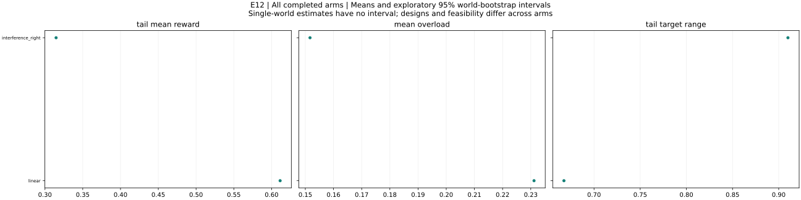

All completed arms: world means and exploratory 95% bootstrap intervals. Single-world arms have no interval. Tail windows contain up to 20 observations. Compare configurations and feasibility before interpreting differences.

### interference_right

Example 4.7 right controlled start; finite-width learning variant

interference_right: 1 runs across 1 worlds. Final Y = 0.586819; final reward = 0.424249; mean overload = 0.151668. Tail target range = 0.909999; observed outcome-settling fraction = 0. Maximum eligible identification error (averaged over worlds) = 9.12326e-14. Some runs overload the budget; raw-Y efficiency comparisons require qualification. This arm has fewer than ten worlds; treat its pattern as exploratory.

Design flags: none

| Metric | Worlds | Mean | 95% interval |
|---|---:|---:|---|
| initial_Y | 1 | 0.337267 | not estimable to not estimable |
| final_Y | 1 | 0.586819 | not estimable to not estimable |
| final_reward | 1 | 0.424249 | not estimable to not estimable |
| improvement | 1 | 0.249553 | not estimable to not estimable |
| gap_to_best_found | 1 | 0.069345 | not estimable to not estimable |
| settling_period | 0 | not estimable | not estimable to not estimable |
| total_overload | 1 | 1.97168 | not estimable to not estimable |
| skipped_turns | 1 | 0 | not estimable to not estimable |
| jump_events | 1 | 0 | not estimable to not estimable |
| bound_violations | 1 | 0 | not estimable to not estimable |
| tail_target_range | 1 | 0.909999 | not estimable to not estimable |
| target_path_length | 1 | 3.58647 | not estimable to not estimable |
| within_one_percent_best | 1 | 0 | not estimable to not estimable |
| mean_absolute_staleness | 1 | 0.429281 | not estimable to not estimable |
| max_curvature_fit_error | 1 | 9.12326e-14 | not estimable to not estimable |
| max_slope_fit_error | 1 | 8.26006e-14 | not estimable to not estimable |
| max_valid_identification_error | 1 | 9.12326e-14 | not estimable to not estimable |
| max_exploration_formula_error | 1 | 9.73071e-16 | not estimable to not estimable |
| mean_overload | 1 | 0.151668 | not estimable to not estimable |
| overload_period_fraction | 1 | 0.307692 | not estimable to not estimable |
| tail_mean_Y | 1 | 0.466402 | not estimable to not estimable |
| tail_mean_reward | 1 | 0.314734 | not estimable to not estimable |
| tail_price_range | 1 | 1000 | not estimable to not estimable |
| settling_observed | 1 | 0 | not estimable to not estimable |
| skip_fraction | 1 | 0 | not estimable to not estimable |
| eligible_fit_count | 1 | 12 | not estimable to not estimable |
| fit_count | 1 | 12 | not estimable to not estimable |
| max_complementarity_residual | 1 | 1223.92 | not estimable to not estimable |
| final_target_budget_excess | 1 | 0.336598 | not estimable to not estimable |
| final_budget_feasible | 1 | 0 | not estimable to not estimable |
| global_certified | 1 | 0 | not estimable to not estimable |

Configuration: `{"config": {"T": 192, "a_max": 0.08, "beta": 0.7, "budget_rule": "price", "commit": "fixed", "curvature_floor": 0.05, "eps_dis": 0.02, "eta_p": 0.5, "frequencies": "nonresonant", "g0": 1.0, "initial_targets": [0.0, 0.7768698398515702], "k": 1, "lambda_overload": 1.0, "log_executions": false, "multistarts": 8, "non_disruption": "draft", "outside_cost_fraction": 0.3, "outside_kind": "none", "outside_local_gain": 0.3, "outside_period": 150, "outside_relocate": false, "outside_role": 0, "outside_scale": 0.4, "p_max": 1000.0, "p_min": 1e-08, "periods": 12, "phi_mem": 1.0, "price_tol": 1e-10, "rho_dis": 0.05, "schedule": "rotation", "theta_adj": 0.3, "w_min": 0.1, "within_period": "fixed"}, "world": {"alpha_max": 0.3, "budget_factor": 1.0, "n": 5, "s_off": 0.4, "scenario": "example2"}}`

### linear

Example 4.6

linear: 1 runs across 1 worlds. Final Y = 0.370198; final reward = 0.370198; mean overload = 0.231155. Tail target range = 0.667384; observed outcome-settling fraction = 0. Maximum eligible identification error (averaged over worlds) = 4.67182e-13. Some runs overload the budget; raw-Y efficiency comparisons require qualification. This arm has fewer than ten worlds; treat its pattern as exploratory.

Design flags: none

| Metric | Worlds | Mean | 95% interval |
|---|---:|---:|---|
| initial_Y | 1 | 0.948181 | not estimable to not estimable |
| final_Y | 1 | 0.370198 | not estimable to not estimable |
| final_reward | 1 | 0.370198 | not estimable to not estimable |
| improvement | 1 | -0.577983 | not estimable to not estimable |
| gap_to_best_found | 1 | 0.609542 | not estimable to not estimable |
| settling_period | 0 | not estimable | not estimable to not estimable |
| total_overload | 1 | 3.00501 | not estimable to not estimable |
| skipped_turns | 1 | 0 | not estimable to not estimable |
| jump_events | 1 | 0 | not estimable to not estimable |
| bound_violations | 1 | 0 | not estimable to not estimable |
| tail_target_range | 1 | 0.667384 | not estimable to not estimable |
| target_path_length | 1 | 4.67132 | not estimable to not estimable |
| within_one_percent_best | 1 | 0 | not estimable to not estimable |
| mean_absolute_staleness | 1 | 0.0576923 | not estimable to not estimable |
| max_curvature_fit_error | 1 | 2.53703e-13 | not estimable to not estimable |
| max_slope_fit_error | 1 | 4.67182e-13 | not estimable to not estimable |
| max_valid_identification_error | 1 | 4.67182e-13 | not estimable to not estimable |
| max_exploration_formula_error | 1 | 2.77556e-15 | not estimable to not estimable |
| mean_overload | 1 | 0.231155 | not estimable to not estimable |
| overload_period_fraction | 1 | 0.384615 | not estimable to not estimable |
| tail_mean_Y | 1 | 0.842431 | not estimable to not estimable |
| tail_mean_reward | 1 | 0.611276 | not estimable to not estimable |
| tail_price_range | 1 | 1000 | not estimable to not estimable |
| settling_observed | 1 | 0 | not estimable to not estimable |
| skip_fraction | 1 | 0 | not estimable to not estimable |
| eligible_fit_count | 1 | 12 | not estimable to not estimable |
| fit_count | 1 | 12 | not estimable to not estimable |
| max_complementarity_residual | 1 | 1235.02 | not estimable to not estimable |
| final_target_budget_excess | 1 | 0 | not estimable to not estimable |
| final_budget_feasible | 1 | 1 | not estimable to not estimable |
| global_certified | 1 | 1 | not estimable to not estimable |

Configuration: `{"config": {"T": 192, "a_max": 0.08, "beta": 0.7, "budget_rule": "price", "commit": "fixed", "curvature_floor": 0.05, "eps_dis": 0.02, "eta_p": 0.5, "frequencies": "nonresonant", "g0": 1.0, "initial_targets": null, "k": 1, "lambda_overload": 1.0, "log_executions": false, "multistarts": 8, "non_disruption": "draft", "outside_cost_fraction": 0.3, "outside_kind": "none", "outside_local_gain": 0.3, "outside_period": 150, "outside_relocate": false, "outside_role": 0, "outside_scale": 0.4, "p_max": 1000.0, "p_min": 1e-08, "periods": 12, "phi_mem": 1.0, "price_tol": 1e-10, "rho_dis": 0.05, "schedule": "rotation", "theta_adj": 0.3, "w_min": 0.1, "within_period": "fixed"}, "world": {"alpha_max": 0.3, "budget_factor": 1.0, "n": 5, "s_off": 0.4, "scenario": "example1"}}`

## E2 — results and interpretation

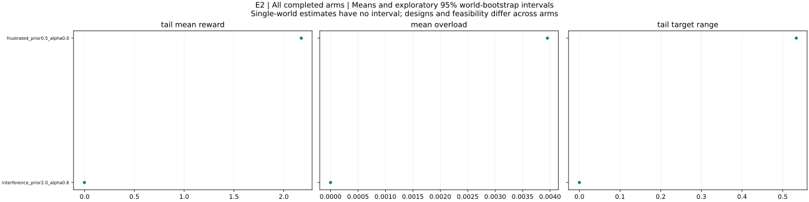

All completed arms: world means and exploratory 95% bootstrap intervals. Single-world arms have no interval. Tail windows contain up to 20 observations. Compare configurations and feasibility before interpreting differences.

### frustrated_prior0.5_alpha0.0

Trap frequency and initial-condition dependence

frustrated_prior0.5_alpha0.0: 1 runs across 1 worlds. Final Y = 2.10698; final reward = 2.10698; mean overload = 0.00395298. Tail target range = 0.533308; observed outcome-settling fraction = 0. Maximum eligible identification error (averaged over worlds) = 2.39808e-13. Some runs overload the budget; raw-Y efficiency comparisons require qualification. This arm has fewer than ten worlds; treat its pattern as exploratory.

Design flags: none

| Metric | Worlds | Mean | 95% interval |
|---|---:|---:|---|
| initial_Y | 1 | 2.35485 | not estimable to not estimable |
| final_Y | 1 | 2.10698 | not estimable to not estimable |
| final_reward | 1 | 2.10698 | not estimable to not estimable |
| improvement | 1 | -0.247871 | not estimable to not estimable |
| gap_to_best_found | 1 | 0.414939 | not estimable to not estimable |
| settling_period | 0 | not estimable | not estimable to not estimable |
| total_overload | 1 | 0.0513888 | not estimable to not estimable |
| skipped_turns | 1 | 0 | not estimable to not estimable |
| jump_events | 1 | 0 | not estimable to not estimable |
| bound_violations | 1 | 0 | not estimable to not estimable |
| tail_target_range | 1 | 0.533308 | not estimable to not estimable |
| target_path_length | 1 | 2.5693 | not estimable to not estimable |
| within_one_percent_best | 1 | 0 | not estimable to not estimable |
| mean_absolute_staleness | 1 | 0.360094 | not estimable to not estimable |
| max_curvature_fit_error | 1 | 1.78413e-13 | not estimable to not estimable |
| max_slope_fit_error | 1 | 2.39808e-13 | not estimable to not estimable |
| max_valid_identification_error | 1 | 2.39808e-13 | not estimable to not estimable |
| max_exploration_formula_error | 1 | 4.28325e-15 | not estimable to not estimable |
| mean_overload | 1 | 0.00395298 | not estimable to not estimable |
| overload_period_fraction | 1 | 0.0769231 | not estimable to not estimable |
| tail_mean_Y | 1 | 2.18042 | not estimable to not estimable |
| tail_mean_reward | 1 | 2.17646 | not estimable to not estimable |
| tail_price_range | 1 | 1000 | not estimable to not estimable |
| settling_observed | 1 | 0 | not estimable to not estimable |
| skip_fraction | 1 | 0 | not estimable to not estimable |
| eligible_fit_count | 1 | 12 | not estimable to not estimable |
| fit_count | 1 | 12 | not estimable to not estimable |
| max_complementarity_residual | 1 | 51.3888 | not estimable to not estimable |
| final_target_budget_excess | 1 | 0.60113 | not estimable to not estimable |
| final_budget_feasible | 1 | 1 | not estimable to not estimable |
| global_certified | 1 | 0 | not estimable to not estimable |

Configuration: `{"config": {"T": 192, "a_max": 0.08, "beta": 0.7, "budget_rule": "price", "commit": "fixed", "curvature_floor": 0.05, "eps_dis": 0.02, "eta_p": 0.5, "frequencies": "nonresonant", "g0": 0.5, "initial_targets": null, "k": 1, "lambda_overload": 1.0, "log_executions": false, "multistarts": 8, "non_disruption": "draft", "outside_cost_fraction": 0.3, "outside_kind": "none", "outside_local_gain": 0.3, "outside_period": 150, "outside_relocate": false, "outside_role": 0, "outside_scale": 0.4, "p_max": 1000.0, "p_min": 1e-08, "periods": 12, "phi_mem": 1.0, "price_tol": 1e-10, "rho_dis": 0.05, "schedule": "rotation", "theta_adj": 0.3, "w_min": 0.1, "within_period": "fixed"}, "world": {"alpha_max": 0.0, "budget_factor": 1.0, "n": 5, "s_off": 0.4, "scenario": "frustrated"}}`

### interference_prior2.0_alpha0.6

Trap frequency and initial-condition dependence

interference_prior2.0_alpha0.6: 1 runs across 1 worlds. Final Y = -0.00224907; final reward = -0.00224907; mean overload = 0. Tail target range = 0; observed outcome-settling fraction = 0. Maximum eligible identification error (averaged over worlds) = not estimable. More than half of scheduled turns are skipped on average; effective exploration is limited. This arm has fewer than ten worlds; treat its pattern as exploratory.

Design flags: none

| Metric | Worlds | Mean | 95% interval |
|---|---:|---:|---|
| initial_Y | 1 | -0.00224907 | not estimable to not estimable |
| final_Y | 1 | -0.00224907 | not estimable to not estimable |
| final_reward | 1 | -0.00224907 | not estimable to not estimable |
| improvement | 1 | 0 | not estimable to not estimable |
| gap_to_best_found | 1 | 0.879536 | not estimable to not estimable |
| settling_period | 0 | not estimable | not estimable to not estimable |
| total_overload | 1 | 0 | not estimable to not estimable |
| skipped_turns | 1 | 12 | not estimable to not estimable |
| jump_events | 1 | 0 | not estimable to not estimable |
| bound_violations | 1 | 0 | not estimable to not estimable |
| tail_target_range | 1 | 0 | not estimable to not estimable |
| target_path_length | 1 | 0 | not estimable to not estimable |
| within_one_percent_best | 1 | 0 | not estimable to not estimable |
| mean_absolute_staleness | 1 | 2.33858 | not estimable to not estimable |
| max_curvature_fit_error | 0 | not estimable | not estimable to not estimable |
| max_slope_fit_error | 0 | not estimable | not estimable to not estimable |
| max_valid_identification_error | 0 | not estimable | not estimable to not estimable |
| max_exploration_formula_error | 1 | 1.77636e-15 | not estimable to not estimable |
| mean_overload | 1 | 0 | not estimable to not estimable |
| overload_period_fraction | 1 | 0 | not estimable to not estimable |
| tail_mean_Y | 1 | -0.00224907 | not estimable to not estimable |
| tail_mean_reward | 1 | -0.00224907 | not estimable to not estimable |
| tail_price_range | 1 | 0 | not estimable to not estimable |
| settling_observed | 1 | 0 | not estimable to not estimable |
| skip_fraction | 1 | 1 | not estimable to not estimable |
| eligible_fit_count | 1 | 0 | not estimable to not estimable |
| fit_count | 1 | 0 | not estimable to not estimable |
| max_complementarity_residual | 1 | 1.55233e-10 | not estimable to not estimable |
| final_target_budget_excess | 1 | 0 | not estimable to not estimable |
| final_budget_feasible | 1 | 1 | not estimable to not estimable |
| global_certified | 1 | 0 | not estimable to not estimable |

Configuration: `{"config": {"T": 192, "a_max": 0.08, "beta": 0.7, "budget_rule": "price", "commit": "fixed", "curvature_floor": 0.05, "eps_dis": 0.02, "eta_p": 0.5, "frequencies": "nonresonant", "g0": 2.0, "initial_targets": null, "k": 1, "lambda_overload": 1.0, "log_executions": false, "multistarts": 8, "non_disruption": "draft", "outside_cost_fraction": 0.3, "outside_kind": "none", "outside_local_gain": 0.3, "outside_period": 150, "outside_relocate": false, "outside_role": 0, "outside_scale": 0.4, "p_max": 1000.0, "p_min": 1e-08, "periods": 12, "phi_mem": 1.0, "price_tol": 1e-10, "rho_dis": 0.05, "schedule": "rotation", "theta_adj": 0.3, "w_min": 0.1, "within_period": "fixed"}, "world": {"alpha_max": 0.6, "budget_factor": 1.0, "n": 5, "s_off": 0.4, "scenario": "interference"}}`

## E3 — results and interpretation

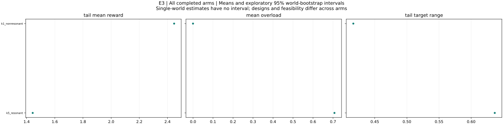

All completed arms: world means and exploratory 95% bootstrap intervals. Single-world arms have no interval. Tail windows contain up to 20 observations. Compare configurations and feasibility before interpreting differences.

### k1_nonresonant

Exact separation and resonant negative controls

k1_nonresonant: 1 runs across 1 worlds. Final Y = 2.51821; final reward = 2.51821; mean overload = 0. Tail target range = 0.41663; observed outcome-settling fraction = 0. Maximum eligible identification error (averaged over worlds) = 3.31957e-13. This arm has fewer than ten worlds; treat its pattern as exploratory.

Design flags: none

| Metric | Worlds | Mean | 95% interval |
|---|---:|---:|---|
| initial_Y | 1 | 2.29276 | not estimable to not estimable |
| final_Y | 1 | 2.51821 | not estimable to not estimable |
| final_reward | 1 | 2.51821 | not estimable to not estimable |
| improvement | 1 | 0.225449 | not estimable to not estimable |
| gap_to_best_found | 1 | 0.00371351 | not estimable to not estimable |
| settling_period | 0 | not estimable | not estimable to not estimable |
| total_overload | 1 | 0 | not estimable to not estimable |
| skipped_turns | 1 | 0 | not estimable to not estimable |
| jump_events | 1 | 0 | not estimable to not estimable |
| bound_violations | 1 | 0 | not estimable to not estimable |
| tail_target_range | 1 | 0.41663 | not estimable to not estimable |
| target_path_length | 1 | 1.06701 | not estimable to not estimable |
| within_one_percent_best | 1 | 1 | not estimable to not estimable |
| mean_absolute_staleness | 1 | 0.188943 | not estimable to not estimable |
| max_curvature_fit_error | 1 | 3.01925e-13 | not estimable to not estimable |
| max_slope_fit_error | 1 | 3.31957e-13 | not estimable to not estimable |
| max_valid_identification_error | 1 | 3.31957e-13 | not estimable to not estimable |
| max_exploration_formula_error | 1 | 6.45946e-15 | not estimable to not estimable |
| mean_overload | 1 | 0 | not estimable to not estimable |
| overload_period_fraction | 1 | 0 | not estimable to not estimable |
| tail_mean_Y | 1 | 2.44726 | not estimable to not estimable |
| tail_mean_reward | 1 | 2.44726 | not estimable to not estimable |
| tail_price_range | 1 | 0.214715 | not estimable to not estimable |
| settling_observed | 1 | 0 | not estimable to not estimable |
| skip_fraction | 1 | 0 | not estimable to not estimable |
| eligible_fit_count | 1 | 12 | not estimable to not estimable |
| fit_count | 1 | 12 | not estimable to not estimable |
| max_complementarity_residual | 1 | 2.22664e-10 | not estimable to not estimable |
| final_target_budget_excess | 1 | 0 | not estimable to not estimable |
| final_budget_feasible | 1 | 1 | not estimable to not estimable |
| global_certified | 1 | 0 | not estimable to not estimable |

Configuration: `{"config": {"T": 192, "a_max": 0.08, "beta": 0.7, "budget_rule": "price", "commit": "fixed", "curvature_floor": 0.05, "eps_dis": 0.02, "eta_p": 0.5, "frequencies": "nonresonant", "g0": 1.0, "initial_targets": null, "k": 1, "lambda_overload": 1.0, "log_executions": false, "multistarts": 8, "non_disruption": "draft", "outside_cost_fraction": 0.3, "outside_kind": "none", "outside_local_gain": 0.3, "outside_period": 150, "outside_relocate": false, "outside_role": 0, "outside_scale": 0.4, "p_max": 1000.0, "p_min": 1e-08, "periods": 12, "phi_mem": 1.0, "price_tol": 1e-10, "rho_dis": 0.05, "schedule": "rotation", "theta_adj": 0.3, "w_min": 0.1, "within_period": "fixed"}, "world": {"alpha_max": 0.3, "budget_factor": 1.0, "n": 5, "s_off": 0.4, "scenario": "frustrated"}}`

### k5_resonant

Exact separation and resonant negative controls

k5_resonant: 1 runs across 1 worlds. Final Y = 1.67796; final reward = 1.67796; mean overload = 0.707219. Tail target range = 0.636704; observed outcome-settling fraction = 0. Maximum eligible identification error (averaged over worlds) = not estimable. Some runs overload the budget; raw-Y efficiency comparisons require qualification. This arm has fewer than ten worlds; treat its pattern as exploratory.

Design flags: During all-explorer periods price cannot adjust any free setting

| Metric | Worlds | Mean | 95% interval |
|---|---:|---:|---|
| initial_Y | 1 | 2.29276 | not estimable to not estimable |
| final_Y | 1 | 1.67796 | not estimable to not estimable |
| final_reward | 1 | 1.67796 | not estimable to not estimable |
| improvement | 1 | -0.614801 | not estimable to not estimable |
| gap_to_best_found | 1 | 0.843964 | not estimable to not estimable |
| settling_period | 0 | not estimable | not estimable to not estimable |
| total_overload | 1 | 9.19384 | not estimable to not estimable |
| skipped_turns | 1 | 18 | not estimable to not estimable |
| jump_events | 1 | 0 | not estimable to not estimable |
| bound_violations | 1 | 0 | not estimable to not estimable |
| tail_target_range | 1 | 0.636704 | not estimable to not estimable |
| target_path_length | 1 | 10.81 | not estimable to not estimable |
| within_one_percent_best | 1 | 0 | not estimable to not estimable |
| mean_absolute_staleness | 1 | 0.322978 | not estimable to not estimable |
| max_curvature_fit_error | 1 | 0.591055 | not estimable to not estimable |
| max_slope_fit_error | 1 | 0.877744 | not estimable to not estimable |
| max_valid_identification_error | 0 | not estimable | not estimable to not estimable |
| max_exploration_formula_error | 1 | 2.51752e-15 | not estimable to not estimable |
| mean_overload | 1 | 0.707219 | not estimable to not estimable |
| overload_period_fraction | 1 | 0.461538 | not estimable to not estimable |
| tail_mean_Y | 1 | 2.15037 | not estimable to not estimable |
| tail_mean_reward | 1 | 1.44315 | not estimable to not estimable |
| tail_price_range | 1 | 1000 | not estimable to not estimable |
| settling_observed | 1 | 0 | not estimable to not estimable |
| skip_fraction | 1 | 0.3 | not estimable to not estimable |
| eligible_fit_count | 1 | 0 | not estimable to not estimable |
| fit_count | 1 | 42 | not estimable to not estimable |
| max_complementarity_residual | 1 | 2445.36 | not estimable to not estimable |
| final_target_budget_excess | 1 | 2.23745 | not estimable to not estimable |
| final_budget_feasible | 1 | 1 | not estimable to not estimable |
| global_certified | 1 | 0 | not estimable to not estimable |

Configuration: `{"config": {"T": 192, "a_max": 0.08, "beta": 0.7, "budget_rule": "price", "commit": "fixed", "curvature_floor": 0.05, "eps_dis": 0.02, "eta_p": 0.5, "frequencies": "resonant", "g0": 1.0, "initial_targets": null, "k": 5, "lambda_overload": 1.0, "log_executions": false, "multistarts": 8, "non_disruption": "draft", "outside_cost_fraction": 0.3, "outside_kind": "none", "outside_local_gain": 0.3, "outside_period": 150, "outside_relocate": false, "outside_role": 0, "outside_scale": 0.4, "p_max": 1000.0, "p_min": 1e-08, "periods": 12, "phi_mem": 1.0, "price_tol": 1e-10, "rho_dis": 0.05, "schedule": "rotation", "theta_adj": 0.3, "w_min": 0.1, "within_period": "fixed"}, "world": {"alpha_max": 0.3, "budget_factor": 1.0, "n": 5, "s_off": 0.4, "scenario": "frustrated"}}`

## E4 — results and interpretation

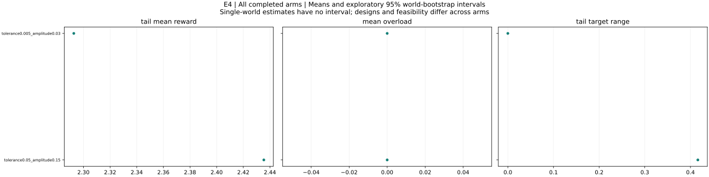

All completed arms: world means and exploratory 95% bootstrap intervals. Single-world arms have no interval. Tail windows contain up to 20 observations. Compare configurations and feasibility before interpreting differences.

### tolerance0.005_amplitude0.03

Disruption and skipped-turn feasibility

tolerance0.005_amplitude0.03: 1 runs across 1 worlds. Final Y = 2.29276; final reward = 2.29276; mean overload = 0. Tail target range = 0; observed outcome-settling fraction = 0. Maximum eligible identification error (averaged over worlds) = not estimable. More than half of scheduled turns are skipped on average; effective exploration is limited. This arm has fewer than ten worlds; treat its pattern as exploratory.

Design flags: All scheduled turns necessarily skip: a_max < w_min/2

| Metric | Worlds | Mean | 95% interval |
|---|---:|---:|---|
| initial_Y | 1 | 2.29276 | not estimable to not estimable |
| final_Y | 1 | 2.29276 | not estimable to not estimable |
| final_reward | 1 | 2.29276 | not estimable to not estimable |
| improvement | 1 | 0 | not estimable to not estimable |
| gap_to_best_found | 1 | 0.229163 | not estimable to not estimable |
| settling_period | 0 | not estimable | not estimable to not estimable |
| total_overload | 1 | 0 | not estimable to not estimable |
| skipped_turns | 1 | 12 | not estimable to not estimable |
| jump_events | 1 | 0 | not estimable to not estimable |
| bound_violations | 1 | 0 | not estimable to not estimable |
| tail_target_range | 1 | 0 | not estimable to not estimable |
| target_path_length | 1 | 0 | not estimable to not estimable |
| within_one_percent_best | 1 | 0 | not estimable to not estimable |
| mean_absolute_staleness | 1 | 0.44687 | not estimable to not estimable |
| max_curvature_fit_error | 0 | not estimable | not estimable to not estimable |
| max_slope_fit_error | 0 | not estimable | not estimable to not estimable |
| max_valid_identification_error | 0 | not estimable | not estimable to not estimable |
| max_exploration_formula_error | 1 | 1.77636e-15 | not estimable to not estimable |
| mean_overload | 1 | 0 | not estimable to not estimable |
| overload_period_fraction | 1 | 0 | not estimable to not estimable |
| tail_mean_Y | 1 | 2.29276 | not estimable to not estimable |
| tail_mean_reward | 1 | 2.29276 | not estimable to not estimable |
| tail_price_range | 1 | 0 | not estimable to not estimable |
| settling_observed | 1 | 0 | not estimable to not estimable |
| skip_fraction | 1 | 1 | not estimable to not estimable |
| eligible_fit_count | 1 | 0 | not estimable to not estimable |
| fit_count | 1 | 0 | not estimable to not estimable |
| max_complementarity_residual | 1 | 2.22664e-10 | not estimable to not estimable |
| final_target_budget_excess | 1 | 0 | not estimable to not estimable |
| final_budget_feasible | 1 | 1 | not estimable to not estimable |
| global_certified | 1 | 0 | not estimable to not estimable |

Configuration: `{"config": {"T": 192, "a_max": 0.03, "beta": 0.7, "budget_rule": "price", "commit": "fixed", "curvature_floor": 0.05, "eps_dis": 0.005, "eta_p": 0.5, "frequencies": "nonresonant", "g0": 1.0, "initial_targets": null, "k": 1, "lambda_overload": 1.0, "log_executions": false, "multistarts": 8, "non_disruption": "draft", "outside_cost_fraction": 0.3, "outside_kind": "none", "outside_local_gain": 0.3, "outside_period": 150, "outside_relocate": false, "outside_role": 0, "outside_scale": 0.4, "p_max": 1000.0, "p_min": 1e-08, "periods": 12, "phi_mem": 1.0, "price_tol": 1e-10, "rho_dis": 0.05, "schedule": "rotation", "theta_adj": 0.3, "w_min": 0.1, "within_period": "fixed"}, "world": {"alpha_max": 0.3, "budget_factor": 1.0, "n": 5, "s_off": 0.4, "scenario": "frustrated"}}`

### tolerance0.05_amplitude0.15

Disruption and skipped-turn feasibility

tolerance0.05_amplitude0.15: 1 runs across 1 worlds. Final Y = 2.51444; final reward = 2.51444; mean overload = 0. Tail target range = 0.416234; observed outcome-settling fraction = 0. Maximum eligible identification error (averaged over worlds) = 8.06022e-14. This arm has fewer than ten worlds; treat its pattern as exploratory.

Design flags: none

| Metric | Worlds | Mean | 95% interval |
|---|---:|---:|---|
| initial_Y | 1 | 2.29276 | not estimable to not estimable |
| final_Y | 1 | 2.51444 | not estimable to not estimable |
| final_reward | 1 | 2.51444 | not estimable to not estimable |
| improvement | 1 | 0.221682 | not estimable to not estimable |
| gap_to_best_found | 1 | 0.00748084 | not estimable to not estimable |
| settling_period | 0 | not estimable | not estimable to not estimable |
| total_overload | 1 | 0 | not estimable to not estimable |
| skipped_turns | 1 | 0 | not estimable to not estimable |
| jump_events | 1 | 0 | not estimable to not estimable |
| bound_violations | 1 | 0 | not estimable to not estimable |
| tail_target_range | 1 | 0.416234 | not estimable to not estimable |
| target_path_length | 1 | 1.07762 | not estimable to not estimable |
| within_one_percent_best | 1 | 1 | not estimable to not estimable |
| mean_absolute_staleness | 1 | 0.188562 | not estimable to not estimable |
| max_curvature_fit_error | 1 | 6.56697e-14 | not estimable to not estimable |
| max_slope_fit_error | 1 | 8.06022e-14 | not estimable to not estimable |
| max_valid_identification_error | 1 | 8.06022e-14 | not estimable to not estimable |
| max_exploration_formula_error | 1 | 5.29438e-15 | not estimable to not estimable |
| mean_overload | 1 | 0 | not estimable to not estimable |
| overload_period_fraction | 1 | 0 | not estimable to not estimable |
| tail_mean_Y | 1 | 2.43541 | not estimable to not estimable |
| tail_mean_reward | 1 | 2.43541 | not estimable to not estimable |
| tail_price_range | 1 | 0.217384 | not estimable to not estimable |
| settling_observed | 1 | 0 | not estimable to not estimable |
| skip_fraction | 1 | 0 | not estimable to not estimable |
| eligible_fit_count | 1 | 12 | not estimable to not estimable |
| fit_count | 1 | 12 | not estimable to not estimable |
| max_complementarity_residual | 1 | 2.22664e-10 | not estimable to not estimable |
| final_target_budget_excess | 1 | 0 | not estimable to not estimable |
| final_budget_feasible | 1 | 1 | not estimable to not estimable |
| global_certified | 1 | 0 | not estimable to not estimable |

Configuration: `{"config": {"T": 192, "a_max": 0.15, "beta": 0.7, "budget_rule": "price", "commit": "fixed", "curvature_floor": 0.05, "eps_dis": 0.05, "eta_p": 0.5, "frequencies": "nonresonant", "g0": 1.0, "initial_targets": null, "k": 1, "lambda_overload": 1.0, "log_executions": false, "multistarts": 8, "non_disruption": "draft", "outside_cost_fraction": 0.3, "outside_kind": "none", "outside_local_gain": 0.3, "outside_period": 150, "outside_relocate": false, "outside_role": 0, "outside_scale": 0.4, "p_max": 1000.0, "p_min": 1e-08, "periods": 12, "phi_mem": 1.0, "price_tol": 1e-10, "rho_dis": 0.05, "schedule": "rotation", "theta_adj": 0.3, "w_min": 0.1, "within_period": "fixed"}, "world": {"alpha_max": 0.3, "budget_factor": 1.0, "n": 5, "s_off": 0.4, "scenario": "frustrated"}}`

## E5 — results and interpretation

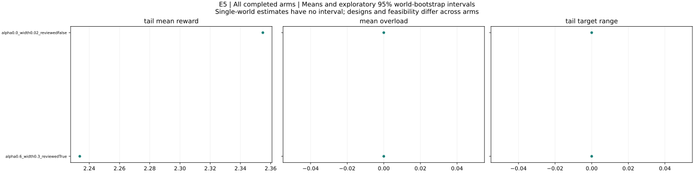

All completed arms: world means and exploratory 95% bootstrap intervals. Single-world arms have no interval. Tail windows contain up to 20 observations. Compare configurations and feasibility before interpreting differences.

### alpha0.0_width0.02_reviewedFalse

Private motives versus self-commitment

alpha0.0_width0.02_reviewedFalse: 1 runs across 1 worlds. Final Y = 2.35485; final reward = 2.35485; mean overload = 0. Tail target range = 0; observed outcome-settling fraction = 0. Maximum eligible identification error (averaged over worlds) = not estimable. This arm has fewer than ten worlds; treat its pattern as exploratory.

Design flags: none

| Metric | Worlds | Mean | 95% interval |
|---|---:|---:|---|
| initial_Y | 1 | 2.35485 | not estimable to not estimable |
| final_Y | 1 | 2.35485 | not estimable to not estimable |
| final_reward | 1 | 2.35485 | not estimable to not estimable |
| improvement | 1 | 0 | not estimable to not estimable |
| gap_to_best_found | 1 | 0.167068 | not estimable to not estimable |
| settling_period | 0 | not estimable | not estimable to not estimable |
| total_overload | 1 | 0 | not estimable to not estimable |
| skipped_turns | 1 | 0 | not estimable to not estimable |
| jump_events | 1 | 0 | not estimable to not estimable |
| bound_violations | 1 | 0 | not estimable to not estimable |
| tail_target_range | 1 | 0 | not estimable to not estimable |
| target_path_length | 1 | 0 | not estimable to not estimable |
| within_one_percent_best | 1 | 0 | not estimable to not estimable |
| mean_absolute_staleness | 1 | 0.447179 | not estimable to not estimable |
| max_curvature_fit_error | 0 | not estimable | not estimable to not estimable |
| max_slope_fit_error | 0 | not estimable | not estimable to not estimable |
| max_valid_identification_error | 0 | not estimable | not estimable to not estimable |
| max_exploration_formula_error | 1 | 1.77636e-15 | not estimable to not estimable |
| mean_overload | 1 | 0 | not estimable to not estimable |
| overload_period_fraction | 1 | 0 | not estimable to not estimable |
| tail_mean_Y | 1 | 2.35485 | not estimable to not estimable |
| tail_mean_reward | 1 | 2.35485 | not estimable to not estimable |
| tail_price_range | 1 | 0 | not estimable to not estimable |
| settling_observed | 1 | 0 | not estimable to not estimable |
| skip_fraction | 0 | not estimable | not estimable to not estimable |
| eligible_fit_count | 1 | 0 | not estimable to not estimable |
| fit_count | 1 | 0 | not estimable to not estimable |
| max_complementarity_residual | 1 | 5.91758e-11 | not estimable to not estimable |
| final_target_budget_excess | 1 | 0 | not estimable to not estimable |
| final_budget_feasible | 1 | 1 | not estimable to not estimable |
| global_certified | 1 | 0 | not estimable to not estimable |

Configuration: `{"config": {"T": 192, "a_max": 0.08, "beta": 0.7, "budget_rule": "price", "commit": "fixed", "curvature_floor": 0.05, "eps_dis": 0.02, "eta_p": 0.5, "frequencies": "nonresonant", "g0": 1.0, "initial_targets": null, "k": 1, "lambda_overload": 1.0, "log_executions": false, "multistarts": 8, "non_disruption": "draft", "outside_cost_fraction": 0.3, "outside_kind": "none", "outside_local_gain": 0.3, "outside_period": 150, "outside_relocate": false, "outside_role": 0, "outside_scale": 0.4, "p_max": 1000.0, "p_min": 1e-08, "periods": 0, "phi_mem": 1.0, "price_tol": 1e-10, "rho_dis": 0.05, "schedule": "rotation", "theta_adj": 0.3, "w_min": 0.02, "within_period": "fixed"}, "world": {"alpha_max": 0.0, "budget_factor": 1.0, "n": 5, "s_off": 0.4, "scenario": "frustrated"}}`

### alpha0.6_width0.3_reviewedTrue

Private motives versus self-commitment

alpha0.6_width0.3_reviewedTrue: 1 runs across 1 worlds. Final Y = 2.2337; final reward = 2.2337; mean overload = 0. Tail target range = 0; observed outcome-settling fraction = 0. Maximum eligible identification error (averaged over worlds) = not estimable. More than half of scheduled turns are skipped on average; effective exploration is limited. This arm has fewer than ten worlds; treat its pattern as exploratory.

Design flags: All scheduled turns necessarily skip: a_max < w_min/2

| Metric | Worlds | Mean | 95% interval |
|---|---:|---:|---|
| initial_Y | 1 | 2.2337 | not estimable to not estimable |
| final_Y | 1 | 2.2337 | not estimable to not estimable |
| final_reward | 1 | 2.2337 | not estimable to not estimable |
| improvement | 1 | 0 | not estimable to not estimable |
| gap_to_best_found | 1 | 0.288225 | not estimable to not estimable |
| settling_period | 0 | not estimable | not estimable to not estimable |
| total_overload | 1 | 0 | not estimable to not estimable |
| skipped_turns | 1 | 12 | not estimable to not estimable |
| jump_events | 1 | 0 | not estimable to not estimable |
| bound_violations | 1 | 0 | not estimable to not estimable |
| tail_target_range | 1 | 0 | not estimable to not estimable |
| target_path_length | 1 | 0 | not estimable to not estimable |
| within_one_percent_best | 1 | 0 | not estimable to not estimable |
| mean_absolute_staleness | 1 | 0.444162 | not estimable to not estimable |
| max_curvature_fit_error | 0 | not estimable | not estimable to not estimable |
| max_slope_fit_error | 0 | not estimable | not estimable to not estimable |
| max_valid_identification_error | 0 | not estimable | not estimable to not estimable |
| max_exploration_formula_error | 1 | 1.33227e-15 | not estimable to not estimable |
| mean_overload | 1 | 0 | not estimable to not estimable |
| overload_period_fraction | 1 | 0 | not estimable to not estimable |
| tail_mean_Y | 1 | 2.2337 | not estimable to not estimable |
| tail_mean_reward | 1 | 2.2337 | not estimable to not estimable |
| tail_price_range | 1 | 0 | not estimable to not estimable |
| settling_observed | 1 | 0 | not estimable to not estimable |
| skip_fraction | 1 | 1 | not estimable to not estimable |
| eligible_fit_count | 1 | 0 | not estimable to not estimable |
| fit_count | 1 | 0 | not estimable to not estimable |
| max_complementarity_residual | 1 | 9.55765e-11 | not estimable to not estimable |
| final_target_budget_excess | 1 | 0 | not estimable to not estimable |
| final_budget_feasible | 1 | 1 | not estimable to not estimable |
| global_certified | 1 | 0 | not estimable to not estimable |

Configuration: `{"config": {"T": 192, "a_max": 0.08, "beta": 0.7, "budget_rule": "price", "commit": "fixed", "curvature_floor": 0.05, "eps_dis": 0.02, "eta_p": 0.5, "frequencies": "nonresonant", "g0": 1.0, "initial_targets": null, "k": 1, "lambda_overload": 1.0, "log_executions": false, "multistarts": 8, "non_disruption": "draft", "outside_cost_fraction": 0.3, "outside_kind": "none", "outside_local_gain": 0.3, "outside_period": 150, "outside_relocate": false, "outside_role": 0, "outside_scale": 0.4, "p_max": 1000.0, "p_min": 1e-08, "periods": 12, "phi_mem": 1.0, "price_tol": 1e-10, "rho_dis": 0.05, "schedule": "rotation", "theta_adj": 0.3, "w_min": 0.3, "within_period": "fixed"}, "world": {"alpha_max": 0.6, "budget_factor": 1.0, "n": 5, "s_off": 0.4, "scenario": "frustrated"}}`

## E6 — results and interpretation

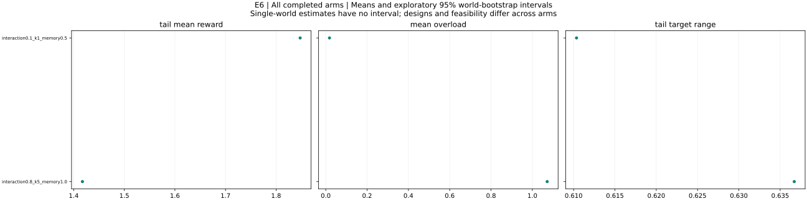

All completed arms: world means and exploratory 95% bootstrap intervals. Single-world arms have no interval. Tail windows contain up to 20 observations. Compare configurations and feasibility before interpreting differences.

### interaction0.1_k1_memory0.5

Staleness, damping of beliefs and oscillations

interaction0.1_k1_memory0.5: 1 runs across 1 worlds. Final Y = 1.79912; final reward = 1.79912; mean overload = 0.0179616. Tail target range = 0.61035; observed outcome-settling fraction = 0. Maximum eligible identification error (averaged over worlds) = 2.21601e-13. Some runs overload the budget; raw-Y efficiency comparisons require qualification. This arm has fewer than ten worlds; treat its pattern as exploratory.

Design flags: none

| Metric | Worlds | Mean | 95% interval |
|---|---:|---:|---|
| initial_Y | 1 | 1.89005 | not estimable to not estimable |
| final_Y | 1 | 1.79912 | not estimable to not estimable |
| final_reward | 1 | 1.79912 | not estimable to not estimable |
| improvement | 1 | -0.0909288 | not estimable to not estimable |
| gap_to_best_found | 1 | 0.195473 | not estimable to not estimable |
| settling_period | 0 | not estimable | not estimable to not estimable |
| total_overload | 1 | 0.2335 | not estimable to not estimable |
| skipped_turns | 1 | 0 | not estimable to not estimable |
| jump_events | 1 | 0 | not estimable to not estimable |
| bound_violations | 1 | 0 | not estimable to not estimable |
| tail_target_range | 1 | 0.61035 | not estimable to not estimable |
| target_path_length | 1 | 2.61516 | not estimable to not estimable |
| within_one_percent_best | 1 | 0 | not estimable to not estimable |
| mean_absolute_staleness | 1 | 0.121424 | not estimable to not estimable |
| max_curvature_fit_error | 1 | 1.71141e-13 | not estimable to not estimable |
| max_slope_fit_error | 1 | 2.21601e-13 | not estimable to not estimable |
| max_valid_identification_error | 1 | 2.21601e-13 | not estimable to not estimable |
| max_exploration_formula_error | 1 | 3.40873e-15 | not estimable to not estimable |
| mean_overload | 1 | 0.0179616 | not estimable to not estimable |
| overload_period_fraction | 1 | 0.153846 | not estimable to not estimable |
| tail_mean_Y | 1 | 1.86547 | not estimable to not estimable |
| tail_mean_reward | 1 | 1.84751 | not estimable to not estimable |
| tail_price_range | 1 | 1000 | not estimable to not estimable |
| settling_observed | 1 | 0 | not estimable to not estimable |
| skip_fraction | 1 | 0 | not estimable to not estimable |
| eligible_fit_count | 1 | 12 | not estimable to not estimable |
| fit_count | 1 | 12 | not estimable to not estimable |
| max_complementarity_residual | 1 | 229.524 | not estimable to not estimable |
| final_target_budget_excess | 1 | 0.144974 | not estimable to not estimable |
| final_budget_feasible | 1 | 1 | not estimable to not estimable |
| global_certified | 1 | 1 | not estimable to not estimable |

Configuration: `{"config": {"T": 192, "a_max": 0.08, "beta": 0.7, "budget_rule": "price", "commit": "fixed", "curvature_floor": 0.05, "eps_dis": 0.02, "eta_p": 0.5, "frequencies": "nonresonant", "g0": 1.0, "initial_targets": null, "k": 1, "lambda_overload": 1.0, "log_executions": false, "multistarts": 8, "non_disruption": "draft", "outside_cost_fraction": 0.3, "outside_kind": "none", "outside_local_gain": 0.3, "outside_period": 150, "outside_relocate": false, "outside_role": 0, "outside_scale": 0.4, "p_max": 1000.0, "p_min": 1e-08, "periods": 12, "phi_mem": 0.5, "price_tol": 1e-10, "rho_dis": 0.05, "schedule": "rotation", "theta_adj": 0.3, "w_min": 0.1, "within_period": "fixed"}, "world": {"alpha_max": 0.3, "budget_factor": 1.0, "n": 5, "s_off": 0.1, "scenario": "frustrated"}}`

### interaction0.8_k5_memory1.0

Staleness, damping of beliefs and oscillations

interaction0.8_k5_memory1.0: 1 runs across 1 worlds. Final Y = 1.04763; final reward = 1.04763; mean overload = 1.07183. Tail target range = 0.636704; observed outcome-settling fraction = 0. Maximum eligible identification error (averaged over worlds) = 9.579e-13. Some runs overload the budget; raw-Y efficiency comparisons require qualification. This arm has fewer than ten worlds; treat its pattern as exploratory.

Design flags: During all-explorer periods price cannot adjust any free setting

| Metric | Worlds | Mean | 95% interval |
|---|---:|---:|---|
| initial_Y | 1 | 2.8297 | not estimable to not estimable |
| final_Y | 1 | 1.04763 | not estimable to not estimable |
| final_reward | 1 | 1.04763 | not estimable to not estimable |
| improvement | 1 | -1.78207 | not estimable to not estimable |
| gap_to_best_found | 1 | 2.462 | not estimable to not estimable |
| settling_period | 0 | not estimable | not estimable to not estimable |
| total_overload | 1 | 13.9338 | not estimable to not estimable |
| skipped_turns | 1 | 0 | not estimable to not estimable |
| jump_events | 1 | 0 | not estimable to not estimable |
| bound_violations | 1 | 0 | not estimable to not estimable |
| tail_target_range | 1 | 0.636704 | not estimable to not estimable |
| target_path_length | 1 | 14.2079 | not estimable to not estimable |
| within_one_percent_best | 1 | 0 | not estimable to not estimable |
| mean_absolute_staleness | 1 | 0.997538 | not estimable to not estimable |
| max_curvature_fit_error | 1 | 6.26221e-13 | not estimable to not estimable |
| max_slope_fit_error | 1 | 9.579e-13 | not estimable to not estimable |
| max_valid_identification_error | 1 | 9.579e-13 | not estimable to not estimable |
| max_exploration_formula_error | 1 | 2.03223e-15 | not estimable to not estimable |
| mean_overload | 1 | 1.07183 | not estimable to not estimable |
| overload_period_fraction | 1 | 0.461538 | not estimable to not estimable |
| tail_mean_Y | 1 | 2.48903 | not estimable to not estimable |
| tail_mean_reward | 1 | 1.4172 | not estimable to not estimable |
| tail_price_range | 1 | 1000 | not estimable to not estimable |
| settling_observed | 1 | 0 | not estimable to not estimable |
| skip_fraction | 1 | 0 | not estimable to not estimable |
| eligible_fit_count | 1 | 60 | not estimable to not estimable |
| fit_count | 1 | 60 | not estimable to not estimable |
| max_complementarity_residual | 1 | 2933.29 | not estimable to not estimable |
| final_target_budget_excess | 1 | 2.80707 | not estimable to not estimable |
| final_budget_feasible | 1 | 1 | not estimable to not estimable |
| global_certified | 1 | 0 | not estimable to not estimable |

Configuration: `{"config": {"T": 192, "a_max": 0.08, "beta": 0.7, "budget_rule": "price", "commit": "fixed", "curvature_floor": 0.05, "eps_dis": 0.02, "eta_p": 0.5, "frequencies": "nonresonant", "g0": 1.0, "initial_targets": null, "k": 5, "lambda_overload": 1.0, "log_executions": false, "multistarts": 8, "non_disruption": "draft", "outside_cost_fraction": 0.3, "outside_kind": "none", "outside_local_gain": 0.3, "outside_period": 150, "outside_relocate": false, "outside_role": 0, "outside_scale": 0.4, "p_max": 1000.0, "p_min": 1e-08, "periods": 12, "phi_mem": 1.0, "price_tol": 1e-10, "rho_dis": 0.05, "schedule": "rotation", "theta_adj": 0.3, "w_min": 0.1, "within_period": "fixed"}, "world": {"alpha_max": 0.3, "budget_factor": 1.0, "n": 5, "s_off": 0.8, "scenario": "frustrated"}}`

## E7 — results and interpretation

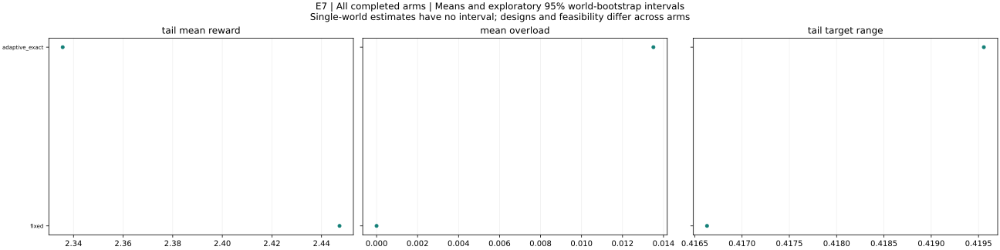

All completed arms: world means and exploratory 95% bootstrap intervals. Single-world arms have no interval. Tail windows contain up to 20 observations. Compare configurations and feasibility before interpreting differences.

### adaptive_exact

Exact-clearing control for the total-derivative proposition

adaptive_exact: 1 runs across 1 worlds. Final Y = 2.53327; final reward = 2.38177; mean overload = 0.0135065. Tail target range = 0.419556; observed outcome-settling fraction = 0. Maximum eligible identification error (averaged over worlds) = not estimable. Some runs overload the budget; raw-Y efficiency comparisons require qualification. This arm has fewer than ten worlds; treat its pattern as exploratory.

Design flags: none

| Metric | Worlds | Mean | 95% interval |
|---|---:|---:|---|
| initial_Y | 1 | 2.29276 | not estimable to not estimable |
| final_Y | 1 | 2.53327 | not estimable to not estimable |
| final_reward | 1 | 2.38177 | not estimable to not estimable |
| improvement | 1 | 0.240511 | not estimable to not estimable |
| gap_to_best_found | 1 | -0.0113477 | not estimable to not estimable |
| settling_period | 0 | not estimable | not estimable to not estimable |
| total_overload | 1 | 0.175585 | not estimable to not estimable |
| skipped_turns | 1 | 0 | not estimable to not estimable |
| jump_events | 1 | 0 | not estimable to not estimable |
| bound_violations | 1 | 0 | not estimable to not estimable |
| tail_target_range | 1 | 0.419556 | not estimable to not estimable |
| target_path_length | 1 | 1.76902 | not estimable to not estimable |
| within_one_percent_best | 1 | 1 | not estimable to not estimable |
| mean_absolute_staleness | 1 | 1.82517 | not estimable to not estimable |
| max_curvature_fit_error | 1 | 4.08139 | not estimable to not estimable |
| max_slope_fit_error | 1 | 4.87789 | not estimable to not estimable |
| max_valid_identification_error | 0 | not estimable | not estimable to not estimable |
| max_exploration_formula_error | 1 | 1.77636e-15 | not estimable to not estimable |
| mean_overload | 1 | 0.0135065 | not estimable to not estimable |
| overload_period_fraction | 1 | 0.153846 | not estimable to not estimable |
| tail_mean_Y | 1 | 2.34915 | not estimable to not estimable |
| tail_mean_reward | 1 | 2.33564 | not estimable to not estimable |
| tail_price_range | 1 | 999.988 | not estimable to not estimable |
| settling_observed | 1 | 0 | not estimable to not estimable |
| skip_fraction | 1 | 0 | not estimable to not estimable |
| eligible_fit_count | 1 | 0 | not estimable to not estimable |
| fit_count | 1 | 12 | not estimable to not estimable |
| max_complementarity_residual | 1 | 151.495 | not estimable to not estimable |
| final_target_budget_excess | 1 | 1.6302 | not estimable to not estimable |
| final_budget_feasible | 1 | 0 | not estimable to not estimable |
| global_certified | 1 | 0 | not estimable to not estimable |

Configuration: `{"config": {"T": 192, "a_max": 0.08, "beta": 0.7, "budget_rule": "price", "commit": "fixed", "curvature_floor": 0.05, "eps_dis": 0.02, "eta_p": 0.5, "frequencies": "nonresonant", "g0": 1.0, "initial_targets": null, "k": 1, "lambda_overload": 1.0, "log_executions": false, "multistarts": 8, "non_disruption": "draft", "outside_cost_fraction": 0.3, "outside_kind": "none", "outside_local_gain": 0.3, "outside_period": 150, "outside_relocate": false, "outside_role": 0, "outside_scale": 0.4, "p_max": 1000.0, "p_min": 1e-08, "periods": 12, "phi_mem": 1.0, "price_tol": 1e-10, "rho_dis": 0.05, "schedule": "rotation", "theta_adj": 0.3, "w_min": 0.1, "within_period": "adaptive_exact"}, "world": {"alpha_max": 0.3, "budget_factor": 1.0, "n": 5, "s_off": 0.4, "scenario": "frustrated"}}`

### fixed

Fixed background reference

fixed: 1 runs across 1 worlds. Final Y = 2.51821; final reward = 2.51821; mean overload = 0. Tail target range = 0.41663; observed outcome-settling fraction = 0. Maximum eligible identification error (averaged over worlds) = 3.31957e-13. This arm has fewer than ten worlds; treat its pattern as exploratory.

Design flags: none

| Metric | Worlds | Mean | 95% interval |
|---|---:|---:|---|
| initial_Y | 1 | 2.29276 | not estimable to not estimable |
| final_Y | 1 | 2.51821 | not estimable to not estimable |
| final_reward | 1 | 2.51821 | not estimable to not estimable |
| improvement | 1 | 0.225449 | not estimable to not estimable |
| gap_to_best_found | 1 | 0.00371351 | not estimable to not estimable |
| settling_period | 0 | not estimable | not estimable to not estimable |
| total_overload | 1 | 0 | not estimable to not estimable |
| skipped_turns | 1 | 0 | not estimable to not estimable |
| jump_events | 1 | 0 | not estimable to not estimable |
| bound_violations | 1 | 0 | not estimable to not estimable |
| tail_target_range | 1 | 0.41663 | not estimable to not estimable |
| target_path_length | 1 | 1.06701 | not estimable to not estimable |
| within_one_percent_best | 1 | 1 | not estimable to not estimable |
| mean_absolute_staleness | 1 | 0.188943 | not estimable to not estimable |
| max_curvature_fit_error | 1 | 3.01925e-13 | not estimable to not estimable |
| max_slope_fit_error | 1 | 3.31957e-13 | not estimable to not estimable |
| max_valid_identification_error | 1 | 3.31957e-13 | not estimable to not estimable |
| max_exploration_formula_error | 1 | 6.45946e-15 | not estimable to not estimable |
| mean_overload | 1 | 0 | not estimable to not estimable |
| overload_period_fraction | 1 | 0 | not estimable to not estimable |
| tail_mean_Y | 1 | 2.44726 | not estimable to not estimable |
| tail_mean_reward | 1 | 2.44726 | not estimable to not estimable |
| tail_price_range | 1 | 0.214715 | not estimable to not estimable |
| settling_observed | 1 | 0 | not estimable to not estimable |
| skip_fraction | 1 | 0 | not estimable to not estimable |
| eligible_fit_count | 1 | 12 | not estimable to not estimable |
| fit_count | 1 | 12 | not estimable to not estimable |
| max_complementarity_residual | 1 | 2.22664e-10 | not estimable to not estimable |
| final_target_budget_excess | 1 | 0 | not estimable to not estimable |
| final_budget_feasible | 1 | 1 | not estimable to not estimable |
| global_certified | 1 | 0 | not estimable to not estimable |

Configuration: `{"config": {"T": 192, "a_max": 0.08, "beta": 0.7, "budget_rule": "price", "commit": "fixed", "curvature_floor": 0.05, "eps_dis": 0.02, "eta_p": 0.5, "frequencies": "nonresonant", "g0": 1.0, "initial_targets": null, "k": 1, "lambda_overload": 1.0, "log_executions": false, "multistarts": 8, "non_disruption": "draft", "outside_cost_fraction": 0.3, "outside_kind": "none", "outside_local_gain": 0.3, "outside_period": 150, "outside_relocate": false, "outside_role": 0, "outside_scale": 0.4, "p_max": 1000.0, "p_min": 1e-08, "periods": 12, "phi_mem": 1.0, "price_tol": 1e-10, "rho_dis": 0.05, "schedule": "rotation", "theta_adj": 0.3, "w_min": 0.1, "within_period": "fixed"}, "world": {"alpha_max": 0.3, "budget_factor": 1.0, "n": 5, "s_off": 0.4, "scenario": "frustrated"}}`

## E8 — results and interpretation

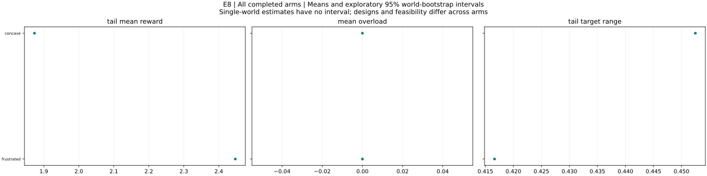

All completed arms: world means and exploratory 95% bootstrap intervals. Single-world arms have no interval. Tail windows contain up to 20 observations. Compare configurations and feasibility before interpreting differences.

### concave

Ignoring interactions versus discovered stationary points

concave: 1 runs across 1 worlds. Final Y = 1.9159; final reward = 1.9159; mean overload = 0. Tail target range = 0.45247; observed outcome-settling fraction = 0. Maximum eligible identification error (averaged over worlds) = 2.07168e-13. This arm has fewer than ten worlds; treat its pattern as exploratory.

Design flags: none

| Metric | Worlds | Mean | 95% interval |
|---|---:|---:|---|
| initial_Y | 1 | 1.72752 | not estimable to not estimable |
| final_Y | 1 | 1.9159 | not estimable to not estimable |
| final_reward | 1 | 1.9159 | not estimable to not estimable |
| improvement | 1 | 0.188375 | not estimable to not estimable |
| gap_to_best_found | 1 | 0.104725 | not estimable to not estimable |
| settling_period | 0 | not estimable | not estimable to not estimable |
| total_overload | 1 | 0 | not estimable to not estimable |
| skipped_turns | 1 | 0 | not estimable to not estimable |
| jump_events | 1 | 0 | not estimable to not estimable |
| bound_violations | 1 | 0 | not estimable to not estimable |
| tail_target_range | 1 | 0.45247 | not estimable to not estimable |
| target_path_length | 1 | 2.18252 | not estimable to not estimable |
| within_one_percent_best | 1 | 0 | not estimable to not estimable |
| mean_absolute_staleness | 1 | 0.214653 | not estimable to not estimable |
| max_curvature_fit_error | 1 | 1.81521e-13 | not estimable to not estimable |
| max_slope_fit_error | 1 | 2.07168e-13 | not estimable to not estimable |
| max_valid_identification_error | 1 | 2.07168e-13 | not estimable to not estimable |
| max_exploration_formula_error | 1 | 4.23836e-15 | not estimable to not estimable |
| mean_overload | 1 | 0 | not estimable to not estimable |
| overload_period_fraction | 1 | 0 | not estimable to not estimable |
| tail_mean_Y | 1 | 1.87335 | not estimable to not estimable |
| tail_mean_reward | 1 | 1.87335 | not estimable to not estimable |
| tail_price_range | 1 | 0.435853 | not estimable to not estimable |
| settling_observed | 1 | 0 | not estimable to not estimable |
| skip_fraction | 1 | 0 | not estimable to not estimable |
| eligible_fit_count | 1 | 12 | not estimable to not estimable |
| fit_count | 1 | 12 | not estimable to not estimable |
| max_complementarity_residual | 1 | 2.22664e-10 | not estimable to not estimable |
| final_target_budget_excess | 1 | 0 | not estimable to not estimable |
| final_budget_feasible | 1 | 1 | not estimable to not estimable |
| global_certified | 1 | 1 | not estimable to not estimable |

Configuration: `{"config": {"T": 192, "a_max": 0.08, "beta": 0.7, "budget_rule": "price", "commit": "fixed", "curvature_floor": 0.05, "eps_dis": 0.02, "eta_p": 0.5, "frequencies": "nonresonant", "g0": 1.0, "initial_targets": null, "k": 1, "lambda_overload": 1.0, "log_executions": false, "multistarts": 8, "non_disruption": "draft", "outside_cost_fraction": 0.3, "outside_kind": "none", "outside_local_gain": 0.3, "outside_period": 150, "outside_relocate": false, "outside_role": 0, "outside_scale": 0.4, "p_max": 1000.0, "p_min": 1e-08, "periods": 12, "phi_mem": 1.0, "price_tol": 1e-10, "rho_dis": 0.05, "schedule": "rotation", "theta_adj": 0.3, "w_min": 0.1, "within_period": "fixed"}, "world": {"alpha_max": 0.3, "budget_factor": 1.0, "n": 5, "s_off": 0.4, "scenario": "concave"}}`

### frustrated

Ignoring interactions versus discovered stationary points

frustrated: 1 runs across 1 worlds. Final Y = 2.51821; final reward = 2.51821; mean overload = 0. Tail target range = 0.41663; observed outcome-settling fraction = 0. Maximum eligible identification error (averaged over worlds) = 3.31957e-13. This arm has fewer than ten worlds; treat its pattern as exploratory.

Design flags: none

| Metric | Worlds | Mean | 95% interval |
|---|---:|---:|---|
| initial_Y | 1 | 2.29276 | not estimable to not estimable |
| final_Y | 1 | 2.51821 | not estimable to not estimable |
| final_reward | 1 | 2.51821 | not estimable to not estimable |
| improvement | 1 | 0.225449 | not estimable to not estimable |
| gap_to_best_found | 1 | 0.00371351 | not estimable to not estimable |
| settling_period | 0 | not estimable | not estimable to not estimable |
| total_overload | 1 | 0 | not estimable to not estimable |
| skipped_turns | 1 | 0 | not estimable to not estimable |
| jump_events | 1 | 0 | not estimable to not estimable |
| bound_violations | 1 | 0 | not estimable to not estimable |
| tail_target_range | 1 | 0.41663 | not estimable to not estimable |
| target_path_length | 1 | 1.06701 | not estimable to not estimable |
| within_one_percent_best | 1 | 1 | not estimable to not estimable |
| mean_absolute_staleness | 1 | 0.188943 | not estimable to not estimable |
| max_curvature_fit_error | 1 | 3.01925e-13 | not estimable to not estimable |
| max_slope_fit_error | 1 | 3.31957e-13 | not estimable to not estimable |
| max_valid_identification_error | 1 | 3.31957e-13 | not estimable to not estimable |
| max_exploration_formula_error | 1 | 6.45946e-15 | not estimable to not estimable |
| mean_overload | 1 | 0 | not estimable to not estimable |
| overload_period_fraction | 1 | 0 | not estimable to not estimable |
| tail_mean_Y | 1 | 2.44726 | not estimable to not estimable |
| tail_mean_reward | 1 | 2.44726 | not estimable to not estimable |
| tail_price_range | 1 | 0.214715 | not estimable to not estimable |
| settling_observed | 1 | 0 | not estimable to not estimable |
| skip_fraction | 1 | 0 | not estimable to not estimable |
| eligible_fit_count | 1 | 12 | not estimable to not estimable |
| fit_count | 1 | 12 | not estimable to not estimable |
| max_complementarity_residual | 1 | 2.22664e-10 | not estimable to not estimable |
| final_target_budget_excess | 1 | 0 | not estimable to not estimable |
| final_budget_feasible | 1 | 1 | not estimable to not estimable |
| global_certified | 1 | 0 | not estimable to not estimable |

Configuration: `{"config": {"T": 192, "a_max": 0.08, "beta": 0.7, "budget_rule": "price", "commit": "fixed", "curvature_floor": 0.05, "eps_dis": 0.02, "eta_p": 0.5, "frequencies": "nonresonant", "g0": 1.0, "initial_targets": null, "k": 1, "lambda_overload": 1.0, "log_executions": false, "multistarts": 8, "non_disruption": "draft", "outside_cost_fraction": 0.3, "outside_kind": "none", "outside_local_gain": 0.3, "outside_period": 150, "outside_relocate": false, "outside_role": 0, "outside_scale": 0.4, "p_max": 1000.0, "p_min": 1e-08, "periods": 12, "phi_mem": 1.0, "price_tol": 1e-10, "rho_dis": 0.05, "schedule": "rotation", "theta_adj": 0.3, "w_min": 0.1, "within_period": "fixed"}, "world": {"alpha_max": 0.3, "budget_factor": 1.0, "n": 5, "s_off": 0.4, "scenario": "frustrated"}}`

## E9 — results and interpretation

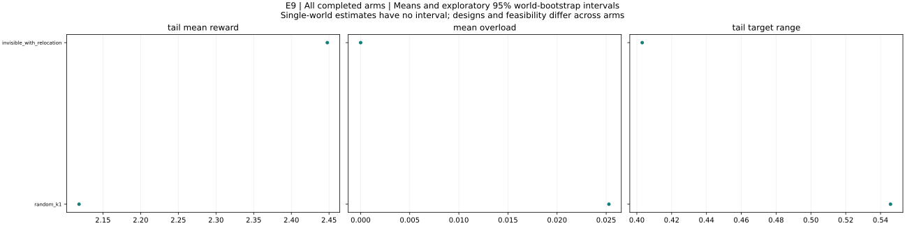

All completed arms: world means and exploratory 95% bootstrap intervals. Single-world arms have no interval. Tail windows contain up to 20 observations. Compare configurations and feasibility before interpreting differences.

### invisible_with_relocation

Explicit informed relocation versus locally invisible intervention

invisible_with_relocation: 1 runs across 1 worlds. Final Y = 2.51691; final reward = 2.51691; mean overload = 0. Tail target range = 0.403086; observed outcome-settling fraction = 0. Maximum eligible identification error (averaged over worlds) = 3.31957e-13. This arm has fewer than ten worlds; treat its pattern as exploratory.

Design flags: none

| Metric | Worlds | Mean | 95% interval |
|---|---:|---:|---|
| initial_Y | 1 | 2.29276 | not estimable to not estimable |
| final_Y | 1 | 2.51691 | not estimable to not estimable |
| final_reward | 1 | 2.51691 | not estimable to not estimable |
| improvement | 1 | 0.224155 | not estimable to not estimable |
| gap_to_best_found | 1 | 0.00489629 | not estimable to not estimable |
| settling_period | 0 | not estimable | not estimable to not estimable |
| total_overload | 1 | 0 | not estimable to not estimable |
| skipped_turns | 1 | 0 | not estimable to not estimable |
| jump_events | 1 | 0 | not estimable to not estimable |
| bound_violations | 1 | 0 | not estimable to not estimable |
| tail_target_range | 1 | 0.403086 | not estimable to not estimable |
| target_path_length | 1 | 1.05315 | not estimable to not estimable |
| within_one_percent_best | 1 | 1 | not estimable to not estimable |
| mean_absolute_staleness | 1 | 0.189515 | not estimable to not estimable |
| max_curvature_fit_error | 1 | 2.91045e-13 | not estimable to not estimable |
| max_slope_fit_error | 1 | 3.31957e-13 | not estimable to not estimable |
| max_valid_identification_error | 1 | 3.31957e-13 | not estimable to not estimable |
| max_exploration_formula_error | 1 | 7.18349e-15 | not estimable to not estimable |
| mean_overload | 1 | 0 | not estimable to not estimable |
| overload_period_fraction | 1 | 0 | not estimable to not estimable |
| tail_mean_Y | 1 | 2.44773 | not estimable to not estimable |
| tail_mean_reward | 1 | 2.44773 | not estimable to not estimable |
| tail_price_range | 1 | 0.214715 | not estimable to not estimable |
| settling_observed | 1 | 0 | not estimable to not estimable |
| skip_fraction | 1 | 0 | not estimable to not estimable |
| eligible_fit_count | 1 | 12 | not estimable to not estimable |
| fit_count | 1 | 12 | not estimable to not estimable |
| max_complementarity_residual | 1 | 2.22664e-10 | not estimable to not estimable |
| final_target_budget_excess | 1 | 0 | not estimable to not estimable |
| final_budget_feasible | 1 | 1 | not estimable to not estimable |
| global_certified | 1 | 0 | not estimable to not estimable |

Configuration: `{"config": {"T": 192, "a_max": 0.08, "beta": 0.7, "budget_rule": "price", "commit": "fixed", "curvature_floor": 0.05, "eps_dis": 0.02, "eta_p": 0.5, "frequencies": "nonresonant", "g0": 1.0, "initial_targets": null, "k": 1, "lambda_overload": 1.0, "log_executions": false, "multistarts": 8, "non_disruption": "draft", "outside_cost_fraction": 0.3, "outside_kind": "invisible", "outside_local_gain": 0.3, "outside_period": 6, "outside_relocate": true, "outside_role": 0, "outside_scale": 0.4, "p_max": 1000.0, "p_min": 1e-08, "periods": 12, "phi_mem": 1.0, "price_tol": 1e-10, "rho_dis": 0.05, "schedule": "rotation", "theta_adj": 0.3, "w_min": 0.1, "within_period": "fixed"}, "world": {"alpha_max": 0.3, "budget_factor": 1.0, "n": 5, "s_off": 0.4, "scenario": "frustrated"}}`

### random_k1

Local visibility and adaptation after outside changes

random_k1: 1 runs across 1 worlds. Final Y = 1.65595; final reward = 1.65595; mean overload = 0.0252778. Tail target range = 0.545722; observed outcome-settling fraction = 0. Maximum eligible identification error (averaged over worlds) = 3.31957e-13. Some runs overload the budget; raw-Y efficiency comparisons require qualification. This arm has fewer than ten worlds; treat its pattern as exploratory.

Design flags: none

| Metric | Worlds | Mean | 95% interval |
|---|---:|---:|---|
| initial_Y | 1 | 2.29276 | not estimable to not estimable |
| final_Y | 1 | 1.65595 | not estimable to not estimable |
| final_reward | 1 | 1.65595 | not estimable to not estimable |
| improvement | 1 | -0.636811 | not estimable to not estimable |
| gap_to_best_found | 1 | 0.770883 | not estimable to not estimable |
| settling_period | 0 | not estimable | not estimable to not estimable |
| total_overload | 1 | 0.328612 | not estimable to not estimable |
| skipped_turns | 1 | 0 | not estimable to not estimable |
| jump_events | 1 | 0 | not estimable to not estimable |
| bound_violations | 1 | 0 | not estimable to not estimable |
| tail_target_range | 1 | 0.545722 | not estimable to not estimable |
| target_path_length | 1 | 2.71708 | not estimable to not estimable |
| within_one_percent_best | 1 | 0 | not estimable to not estimable |
| mean_absolute_staleness | 1 | 0.335733 | not estimable to not estimable |
| max_curvature_fit_error | 1 | 2.91045e-13 | not estimable to not estimable |
| max_slope_fit_error | 1 | 3.31957e-13 | not estimable to not estimable |
| max_valid_identification_error | 1 | 3.31957e-13 | not estimable to not estimable |
| max_exploration_formula_error | 1 | 4.23901e-15 | not estimable to not estimable |
| mean_overload | 1 | 0.0252778 | not estimable to not estimable |
| overload_period_fraction | 1 | 0.0769231 | not estimable to not estimable |
| tail_mean_Y | 1 | 2.14355 | not estimable to not estimable |
| tail_mean_reward | 1 | 2.11828 | not estimable to not estimable |
| tail_price_range | 1 | 1000 | not estimable to not estimable |
| settling_observed | 1 | 0 | not estimable to not estimable |
| skip_fraction | 1 | 0 | not estimable to not estimable |
| eligible_fit_count | 1 | 12 | not estimable to not estimable |
| fit_count | 1 | 12 | not estimable to not estimable |
| max_complementarity_residual | 1 | 328.612 | not estimable to not estimable |
| final_target_budget_excess | 1 | 0 | not estimable to not estimable |
| final_budget_feasible | 1 | 1 | not estimable to not estimable |
| global_certified | 1 | 0 | not estimable to not estimable |

Configuration: `{"config": {"T": 192, "a_max": 0.08, "beta": 0.7, "budget_rule": "price", "commit": "fixed", "curvature_floor": 0.05, "eps_dis": 0.02, "eta_p": 0.5, "frequencies": "nonresonant", "g0": 1.0, "initial_targets": null, "k": 1, "lambda_overload": 1.0, "log_executions": false, "multistarts": 8, "non_disruption": "draft", "outside_cost_fraction": 0.3, "outside_kind": "random", "outside_local_gain": 0.3, "outside_period": 6, "outside_relocate": false, "outside_role": 0, "outside_scale": 0.4, "p_max": 1000.0, "p_min": 1e-08, "periods": 12, "phi_mem": 1.0, "price_tol": 1e-10, "rho_dis": 0.05, "schedule": "rotation", "theta_adj": 0.3, "w_min": 0.1, "within_period": "fixed"}, "world": {"alpha_max": 0.3, "budget_factor": 1.0, "n": 5, "s_off": 0.4, "scenario": "frustrated"}}`

## R1 — results and interpretation

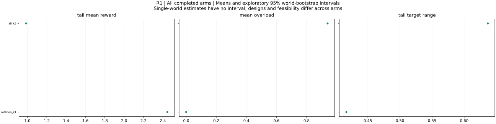

All completed arms: world means and exploratory 95% bootstrap intervals. Single-world arms have no interval. Tail windows contain up to 20 observations. Compare configurations and feasibility before interpreting differences.

### all_k5

Architectural schedule and true replication randomness

all_k5: 1 runs across 1 worlds. Final Y = 0.92684; final reward = 0.92684; mean overload = 0.940058. Tail target range = 0.636704; observed outcome-settling fraction = 0. Maximum eligible identification error (averaged over worlds) = 3.39284e-13. Some runs overload the budget; raw-Y efficiency comparisons require qualification. This arm has fewer than ten worlds; treat its pattern as exploratory.

Design flags: During all-explorer periods price cannot adjust any free setting

| Metric | Worlds | Mean | 95% interval |
|---|---:|---:|---|
| initial_Y | 1 | 2.29276 | not estimable to not estimable |
| final_Y | 1 | 0.92684 | not estimable to not estimable |
| final_reward | 1 | 0.92684 | not estimable to not estimable |
| improvement | 1 | -1.36592 | not estimable to not estimable |
| gap_to_best_found | 1 | 1.59508 | not estimable to not estimable |
| settling_period | 0 | not estimable | not estimable to not estimable |
| total_overload | 1 | 12.2208 | not estimable to not estimable |
| skipped_turns | 1 | 0 | not estimable to not estimable |
| jump_events | 1 | 0 | not estimable to not estimable |
| bound_violations | 1 | 0 | not estimable to not estimable |
| tail_target_range | 1 | 0.636704 | not estimable to not estimable |
| target_path_length | 1 | 13.866 | not estimable to not estimable |
| within_one_percent_best | 1 | 0 | not estimable to not estimable |
| mean_absolute_staleness | 1 | 0.470041 | not estimable to not estimable |
| max_curvature_fit_error | 1 | 2.8022e-13 | not estimable to not estimable |
| max_slope_fit_error | 1 | 3.39284e-13 | not estimable to not estimable |
| max_valid_identification_error | 1 | 3.39284e-13 | not estimable to not estimable |
| max_exploration_formula_error | 1 | 1.77636e-15 | not estimable to not estimable |
| mean_overload | 1 | 0.940058 | not estimable to not estimable |
| overload_period_fraction | 1 | 0.461538 | not estimable to not estimable |
| tail_mean_Y | 1 | 1.92558 | not estimable to not estimable |
| tail_mean_reward | 1 | 0.985521 | not estimable to not estimable |
| tail_price_range | 1 | 1000 | not estimable to not estimable |
| settling_observed | 1 | 0 | not estimable to not estimable |
| skip_fraction | 1 | 0 | not estimable to not estimable |
| eligible_fit_count | 1 | 60 | not estimable to not estimable |
| fit_count | 1 | 60 | not estimable to not estimable |
| max_complementarity_residual | 1 | 2544.83 | not estimable to not estimable |
| final_target_budget_excess | 1 | 2.43956 | not estimable to not estimable |
| final_budget_feasible | 1 | 1 | not estimable to not estimable |
| global_certified | 1 | 0 | not estimable to not estimable |

Configuration: `{"config": {"T": 192, "a_max": 0.08, "beta": 0.7, "budget_rule": "price", "commit": "fixed", "curvature_floor": 0.05, "eps_dis": 0.02, "eta_p": 0.5, "frequencies": "nonresonant", "g0": 1.0, "initial_targets": null, "k": 5, "lambda_overload": 1.0, "log_executions": false, "multistarts": 8, "non_disruption": "draft", "outside_cost_fraction": 0.3, "outside_kind": "none", "outside_local_gain": 0.3, "outside_period": 150, "outside_relocate": false, "outside_role": 0, "outside_scale": 0.4, "p_max": 1000.0, "p_min": 1e-08, "periods": 12, "phi_mem": 1.0, "price_tol": 1e-10, "rho_dis": 0.05, "schedule": "all", "theta_adj": 0.3, "w_min": 0.1, "within_period": "fixed"}, "world": {"alpha_max": 0.3, "budget_factor": 1.0, "n": 5, "s_off": 0.4, "scenario": "frustrated"}}`

### rotation_k1

Architectural schedule and true replication randomness

rotation_k1: 1 runs across 1 worlds. Final Y = 2.51821; final reward = 2.51821; mean overload = 0. Tail target range = 0.41663; observed outcome-settling fraction = 0. Maximum eligible identification error (averaged over worlds) = 3.31957e-13. This arm has fewer than ten worlds; treat its pattern as exploratory.

Design flags: none

| Metric | Worlds | Mean | 95% interval |
|---|---:|---:|---|
| initial_Y | 1 | 2.29276 | not estimable to not estimable |
| final_Y | 1 | 2.51821 | not estimable to not estimable |
| final_reward | 1 | 2.51821 | not estimable to not estimable |
| improvement | 1 | 0.225449 | not estimable to not estimable |
| gap_to_best_found | 1 | 0.00371351 | not estimable to not estimable |
| settling_period | 0 | not estimable | not estimable to not estimable |
| total_overload | 1 | 0 | not estimable to not estimable |
| skipped_turns | 1 | 0 | not estimable to not estimable |
| jump_events | 1 | 0 | not estimable to not estimable |
| bound_violations | 1 | 0 | not estimable to not estimable |
| tail_target_range | 1 | 0.41663 | not estimable to not estimable |
| target_path_length | 1 | 1.06701 | not estimable to not estimable |
| within_one_percent_best | 1 | 1 | not estimable to not estimable |
| mean_absolute_staleness | 1 | 0.188943 | not estimable to not estimable |
| max_curvature_fit_error | 1 | 3.01925e-13 | not estimable to not estimable |
| max_slope_fit_error | 1 | 3.31957e-13 | not estimable to not estimable |
| max_valid_identification_error | 1 | 3.31957e-13 | not estimable to not estimable |
| max_exploration_formula_error | 1 | 6.45946e-15 | not estimable to not estimable |
| mean_overload | 1 | 0 | not estimable to not estimable |
| overload_period_fraction | 1 | 0 | not estimable to not estimable |
| tail_mean_Y | 1 | 2.44726 | not estimable to not estimable |
| tail_mean_reward | 1 | 2.44726 | not estimable to not estimable |
| tail_price_range | 1 | 0.214715 | not estimable to not estimable |
| settling_observed | 1 | 0 | not estimable to not estimable |
| skip_fraction | 1 | 0 | not estimable to not estimable |
| eligible_fit_count | 1 | 12 | not estimable to not estimable |
| fit_count | 1 | 12 | not estimable to not estimable |
| max_complementarity_residual | 1 | 2.22664e-10 | not estimable to not estimable |
| final_target_budget_excess | 1 | 0 | not estimable to not estimable |
| final_budget_feasible | 1 | 1 | not estimable to not estimable |
| global_certified | 1 | 0 | not estimable to not estimable |

Configuration: `{"config": {"T": 192, "a_max": 0.08, "beta": 0.7, "budget_rule": "price", "commit": "fixed", "curvature_floor": 0.05, "eps_dis": 0.02, "eta_p": 0.5, "frequencies": "nonresonant", "g0": 1.0, "initial_targets": null, "k": 1, "lambda_overload": 1.0, "log_executions": false, "multistarts": 8, "non_disruption": "draft", "outside_cost_fraction": 0.3, "outside_kind": "none", "outside_local_gain": 0.3, "outside_period": 150, "outside_relocate": false, "outside_role": 0, "outside_scale": 0.4, "p_max": 1000.0, "p_min": 1e-08, "periods": 12, "phi_mem": 1.0, "price_tol": 1e-10, "rho_dis": 0.05, "schedule": "rotation", "theta_adj": 0.3, "w_min": 0.1, "within_period": "fixed"}, "world": {"alpha_max": 0.3, "budget_factor": 1.0, "n": 5, "s_off": 0.4, "scenario": "frustrated"}}`

## R2 — results and interpretation

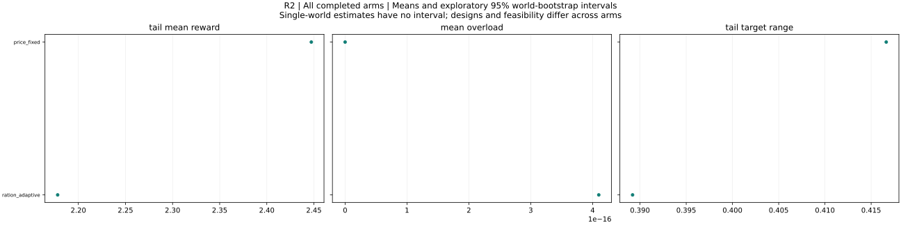

All completed arms: world means and exploratory 95% bootstrap intervals. Single-world arms have no interval. Tail windows contain up to 20 observations. Compare configurations and feasibility before interpreting differences.

### price_fixed

Rationing bounds conflict and adaptive commitment

price_fixed: 1 runs across 1 worlds. Final Y = 2.51821; final reward = 2.51821; mean overload = 0. Tail target range = 0.41663; observed outcome-settling fraction = 0. Maximum eligible identification error (averaged over worlds) = 3.31957e-13. This arm has fewer than ten worlds; treat its pattern as exploratory.

Design flags: none

| Metric | Worlds | Mean | 95% interval |
|---|---:|---:|---|
| initial_Y | 1 | 2.29276 | not estimable to not estimable |
| final_Y | 1 | 2.51821 | not estimable to not estimable |
| final_reward | 1 | 2.51821 | not estimable to not estimable |
| improvement | 1 | 0.225449 | not estimable to not estimable |
| gap_to_best_found | 1 | 0.00371351 | not estimable to not estimable |
| settling_period | 0 | not estimable | not estimable to not estimable |
| total_overload | 1 | 0 | not estimable to not estimable |
| skipped_turns | 1 | 0 | not estimable to not estimable |
| jump_events | 1 | 0 | not estimable to not estimable |
| bound_violations | 1 | 0 | not estimable to not estimable |
| tail_target_range | 1 | 0.41663 | not estimable to not estimable |
| target_path_length | 1 | 1.06701 | not estimable to not estimable |
| within_one_percent_best | 1 | 1 | not estimable to not estimable |
| mean_absolute_staleness | 1 | 0.188943 | not estimable to not estimable |
| max_curvature_fit_error | 1 | 3.01925e-13 | not estimable to not estimable |
| max_slope_fit_error | 1 | 3.31957e-13 | not estimable to not estimable |
| max_valid_identification_error | 1 | 3.31957e-13 | not estimable to not estimable |
| max_exploration_formula_error | 1 | 6.45946e-15 | not estimable to not estimable |
| mean_overload | 1 | 0 | not estimable to not estimable |
| overload_period_fraction | 1 | 0 | not estimable to not estimable |
| tail_mean_Y | 1 | 2.44726 | not estimable to not estimable |
| tail_mean_reward | 1 | 2.44726 | not estimable to not estimable |
| tail_price_range | 1 | 0.214715 | not estimable to not estimable |
| settling_observed | 1 | 0 | not estimable to not estimable |
| skip_fraction | 1 | 0 | not estimable to not estimable |
| eligible_fit_count | 1 | 12 | not estimable to not estimable |
| fit_count | 1 | 12 | not estimable to not estimable |
| max_complementarity_residual | 1 | 2.22664e-10 | not estimable to not estimable |
| final_target_budget_excess | 1 | 0 | not estimable to not estimable |
| final_budget_feasible | 1 | 1 | not estimable to not estimable |
| global_certified | 1 | 0 | not estimable to not estimable |

Configuration: `{"config": {"T": 192, "a_max": 0.08, "beta": 0.7, "budget_rule": "price", "commit": "fixed", "curvature_floor": 0.05, "eps_dis": 0.02, "eta_p": 0.5, "frequencies": "nonresonant", "g0": 1.0, "initial_targets": null, "k": 1, "lambda_overload": 1.0, "log_executions": false, "multistarts": 8, "non_disruption": "draft", "outside_cost_fraction": 0.3, "outside_kind": "none", "outside_local_gain": 0.3, "outside_period": 150, "outside_relocate": false, "outside_role": 0, "outside_scale": 0.4, "p_max": 1000.0, "p_min": 1e-08, "periods": 12, "phi_mem": 1.0, "price_tol": 1e-10, "rho_dis": 0.05, "schedule": "rotation", "theta_adj": 0.3, "w_min": 0.1, "within_period": "fixed"}, "world": {"alpha_max": 0.3, "budget_factor": 1.0, "n": 5, "s_off": 0.4, "scenario": "frustrated"}}`

### ration_adaptive

Rationing bounds conflict and adaptive commitment

ration_adaptive: 1 runs across 1 worlds. Final Y = 1.84217; final reward = 1.84217; mean overload = 4.09929e-16. Tail target range = 0.389199; observed outcome-settling fraction = 0. Maximum eligible identification error (averaged over worlds) = 9.21485e-14. This arm has fewer than ten worlds; treat its pattern as exploratory.

Design flags: Physical rationing may violate commitment lower bounds; violations logged

| Metric | Worlds | Mean | 95% interval |
|---|---:|---:|---|
| initial_Y | 1 | 2.45041 | not estimable to not estimable |
| final_Y | 1 | 1.84217 | not estimable to not estimable |
| final_reward | 1 | 1.84217 | not estimable to not estimable |
| improvement | 1 | -0.608246 | not estimable to not estimable |
| gap_to_best_found | 1 | 0.679756 | not estimable to not estimable |
| settling_period | 0 | not estimable | not estimable to not estimable |
| total_overload | 1 | 5.32907e-15 | not estimable to not estimable |
| skipped_turns | 1 | 0 | not estimable to not estimable |
| jump_events | 1 | 0 | not estimable to not estimable |
| bound_violations | 1 | 7296 | not estimable to not estimable |
| tail_target_range | 1 | 0.389199 | not estimable to not estimable |
| target_path_length | 1 | 1.8704 | not estimable to not estimable |
| within_one_percent_best | 1 | 0 | not estimable to not estimable |
| mean_absolute_staleness | 1 | 0.256599 | not estimable to not estimable |
| max_curvature_fit_error | 1 | 5.60663e-14 | not estimable to not estimable |
| max_slope_fit_error | 1 | 9.21485e-14 | not estimable to not estimable |
| max_valid_identification_error | 1 | 9.21485e-14 | not estimable to not estimable |
| max_exploration_formula_error | 1 | 9.24781e-15 | not estimable to not estimable |
| mean_overload | 1 | 4.09929e-16 | not estimable to not estimable |
| overload_period_fraction | 1 | 0 | not estimable to not estimable |
| tail_mean_Y | 1 | 2.17802 | not estimable to not estimable |
| tail_mean_reward | 1 | 2.17802 | not estimable to not estimable |
| tail_price_range | 1 | 0 | not estimable to not estimable |
| settling_observed | 1 | 0 | not estimable to not estimable |
| skip_fraction | 1 | 0 | not estimable to not estimable |
| eligible_fit_count | 1 | 12 | not estimable to not estimable |
| fit_count | 1 | 12 | not estimable to not estimable |
| max_complementarity_residual | 1 | 0 | not estimable to not estimable |
| final_target_budget_excess | 1 | 14.402 | not estimable to not estimable |
| final_budget_feasible | 1 | 1 | not estimable to not estimable |
| global_certified | 1 | 0 | not estimable to not estimable |

Configuration: `{"config": {"T": 192, "a_max": 0.08, "beta": 0.7, "budget_rule": "ration", "commit": "adaptive", "curvature_floor": 0.05, "eps_dis": 0.02, "eta_p": 0.5, "frequencies": "nonresonant", "g0": 1.0, "initial_targets": null, "k": 1, "lambda_overload": 1.0, "log_executions": false, "multistarts": 8, "non_disruption": "draft", "outside_cost_fraction": 0.3, "outside_kind": "none", "outside_local_gain": 0.3, "outside_period": 150, "outside_relocate": false, "outside_role": 0, "outside_scale": 0.4, "p_max": 1000.0, "p_min": 1e-08, "periods": 12, "phi_mem": 1.0, "price_tol": 1e-10, "rho_dis": 0.05, "schedule": "rotation", "theta_adj": 0.3, "w_min": 0.1, "within_period": "fixed"}, "world": {"alpha_max": 0.3, "budget_factor": 1.0, "n": 5, "s_off": 0.4, "scenario": "frustrated"}}`

## R3 — results and interpretation

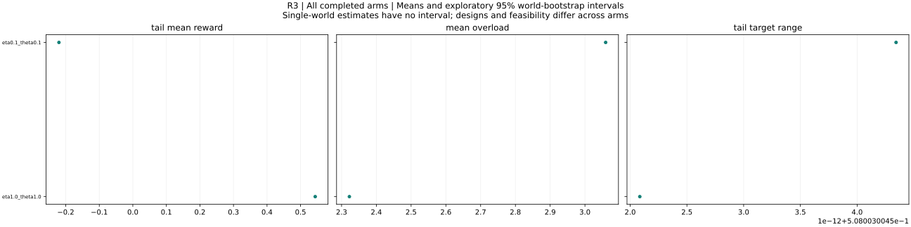

All completed arms: world means and exploratory 95% bootstrap intervals. Single-world arms have no interval. Tail windows contain up to 20 observations. Compare configurations and feasibility before interpreting differences.

### eta0.1_theta0.1

Price-adjustment instability and overload

eta0.1_theta0.1: 1 runs across 1 worlds. Final Y = 3.65954; final reward = -3.87037; mean overload = 3.05957. Tail target range = 0.508003; observed outcome-settling fraction = 0. Maximum eligible identification error (averaged over worlds) = not estimable. Some runs overload the budget; raw-Y efficiency comparisons require qualification. This arm has fewer than ten worlds; treat its pattern as exploratory.

Design flags: none

| Metric | Worlds | Mean | 95% interval |
|---|---:|---:|---|
| initial_Y | 1 | 2.29276 | not estimable to not estimable |
| final_Y | 1 | 3.65954 | not estimable to not estimable |
| final_reward | 1 | -3.87037 | not estimable to not estimable |
| improvement | 1 | 1.36678 | not estimable to not estimable |
| gap_to_best_found | 1 | -1.13762 | not estimable to not estimable |
| settling_period | 0 | not estimable | not estimable to not estimable |
| total_overload | 1 | 39.7745 | not estimable to not estimable |
| skipped_turns | 1 | 0 | not estimable to not estimable |
| jump_events | 1 | 0 | not estimable to not estimable |
| bound_violations | 1 | 0 | not estimable to not estimable |
| tail_target_range | 1 | 0.508003 | not estimable to not estimable |
| target_path_length | 1 | 1.90412 | not estimable to not estimable |
| within_one_percent_best | 1 | 0 | not estimable to not estimable |
| mean_absolute_staleness | 1 | 0.299441 | not estimable to not estimable |
| max_curvature_fit_error | 1 | 0.222929 | not estimable to not estimable |
| max_slope_fit_error | 1 | 0.566196 | not estimable to not estimable |
| max_valid_identification_error | 0 | not estimable | not estimable to not estimable |
| max_exploration_formula_error | 1 | 7.62758e-15 | not estimable to not estimable |
| mean_overload | 1 | 3.05957 | not estimable to not estimable |
| overload_period_fraction | 1 | 0.923077 | not estimable to not estimable |
| tail_mean_Y | 1 | 2.83936 | not estimable to not estimable |
| tail_mean_reward | 1 | -0.220211 | not estimable to not estimable |
| tail_price_range | 1 | 999.597 | not estimable to not estimable |
| settling_observed | 1 | 0 | not estimable to not estimable |
| skip_fraction | 1 | 0 | not estimable to not estimable |
| eligible_fit_count | 1 | 0 | not estimable to not estimable |
| fit_count | 1 | 12 | not estimable to not estimable |
| max_complementarity_residual | 1 | 7529.91 | not estimable to not estimable |
| final_target_budget_excess | 1 | 10.1515 | not estimable to not estimable |
| final_budget_feasible | 1 | 0 | not estimable to not estimable |
| global_certified | 1 | 0 | not estimable to not estimable |

Configuration: `{"config": {"T": 192, "a_max": 0.08, "beta": 0.7, "budget_rule": "price", "commit": "fixed", "curvature_floor": 0.05, "eps_dis": 0.02, "eta_p": 0.1, "frequencies": "nonresonant", "g0": 1.0, "initial_targets": null, "k": 1, "lambda_overload": 1.0, "log_executions": false, "multistarts": 8, "non_disruption": "draft", "outside_cost_fraction": 0.3, "outside_kind": "none", "outside_local_gain": 0.3, "outside_period": 150, "outside_relocate": false, "outside_role": 0, "outside_scale": 0.4, "p_max": 1000.0, "p_min": 1e-08, "periods": 12, "phi_mem": 1.0, "price_tol": 1e-10, "rho_dis": 0.05, "schedule": "rotation", "theta_adj": 0.1, "w_min": 0.1, "within_period": "adaptive"}, "world": {"alpha_max": 0.3, "budget_factor": 1.0, "n": 5, "s_off": 0.4, "scenario": "frustrated"}}`

### eta1.0_theta1.0

Price-adjustment instability and overload

eta1.0_theta1.0: 1 runs across 1 worlds. Final Y = 3.61579; final reward = -3.17743; mean overload = 2.32244. Tail target range = 0.508003; observed outcome-settling fraction = 0. Maximum eligible identification error (averaged over worlds) = not estimable. Some runs overload the budget; raw-Y efficiency comparisons require qualification. This arm has fewer than ten worlds; treat its pattern as exploratory.

Design flags: none

| Metric | Worlds | Mean | 95% interval |
|---|---:|---:|---|
| initial_Y | 1 | 2.29276 | not estimable to not estimable |
| final_Y | 1 | 3.61579 | not estimable to not estimable |
| final_reward | 1 | -3.17743 | not estimable to not estimable |
| improvement | 1 | 1.32303 | not estimable to not estimable |
| gap_to_best_found | 1 | -1.09387 | not estimable to not estimable |
| settling_period | 0 | not estimable | not estimable to not estimable |
| total_overload | 1 | 30.1918 | not estimable to not estimable |
| skipped_turns | 1 | 0 | not estimable to not estimable |
| jump_events | 1 | 0 | not estimable to not estimable |
| bound_violations | 1 | 0 | not estimable to not estimable |
| tail_target_range | 1 | 0.508003 | not estimable to not estimable |
| target_path_length | 1 | 2.14289 | not estimable to not estimable |
| within_one_percent_best | 1 | 0 | not estimable to not estimable |
| mean_absolute_staleness | 1 | 0.487921 | not estimable to not estimable |
| max_curvature_fit_error | 1 | 2.18691 | not estimable to not estimable |
| max_slope_fit_error | 1 | 2.19398 | not estimable to not estimable |
| max_valid_identification_error | 0 | not estimable | not estimable to not estimable |
| max_exploration_formula_error | 1 | 6.22289e-15 | not estimable to not estimable |
| mean_overload | 1 | 2.32244 | not estimable to not estimable |
| overload_period_fraction | 1 | 0.923077 | not estimable to not estimable |
| tail_mean_Y | 1 | 2.8661 | not estimable to not estimable |
| tail_mean_reward | 1 | 0.543655 | not estimable to not estimable |
| tail_price_range | 1 | 999.825 | not estimable to not estimable |
| settling_observed | 1 | 0 | not estimable to not estimable |
| skip_fraction | 1 | 0 | not estimable to not estimable |
| eligible_fit_count | 1 | 0 | not estimable to not estimable |
| fit_count | 1 | 12 | not estimable to not estimable |
| max_complementarity_residual | 1 | 6793.22 | not estimable to not estimable |
| final_target_budget_excess | 1 | 9.48521 | not estimable to not estimable |
| final_budget_feasible | 1 | 0 | not estimable to not estimable |
| global_certified | 1 | 0 | not estimable to not estimable |

Configuration: `{"config": {"T": 192, "a_max": 0.08, "beta": 0.7, "budget_rule": "price", "commit": "fixed", "curvature_floor": 0.05, "eps_dis": 0.02, "eta_p": 1.0, "frequencies": "nonresonant", "g0": 1.0, "initial_targets": null, "k": 1, "lambda_overload": 1.0, "log_executions": false, "multistarts": 8, "non_disruption": "draft", "outside_cost_fraction": 0.3, "outside_kind": "none", "outside_local_gain": 0.3, "outside_period": 150, "outside_relocate": false, "outside_role": 0, "outside_scale": 0.4, "p_max": 1000.0, "p_min": 1e-08, "periods": 12, "phi_mem": 1.0, "price_tol": 1e-10, "rho_dis": 0.05, "schedule": "rotation", "theta_adj": 1.0, "w_min": 0.1, "within_period": "adaptive"}, "world": {"alpha_max": 0.3, "budget_factor": 1.0, "n": 5, "s_off": 0.4, "scenario": "frustrated"}}`

## R4 — results and interpretation

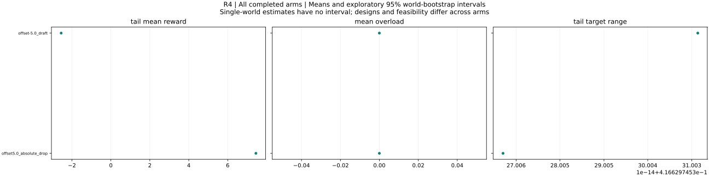

All completed arms: world means and exploratory 95% bootstrap intervals. Single-world arms have no interval. Tail windows contain up to 20 observations. Compare configurations and feasibility before interpreting differences.

### offset-5.0_draft

Translation/sign sensitivity of disruption rules

offset-5.0_draft: 1 runs across 1 worlds. Final Y = -2.48179; final reward = -2.48179; mean overload = 0. Tail target range = 0.41663; observed outcome-settling fraction = 0. Maximum eligible identification error (averaged over worlds) = 4.90052e-13. This arm has fewer than ten worlds; treat its pattern as exploratory.

Design flags: none

| Metric | Worlds | Mean | 95% interval |
|---|---:|---:|---|
| initial_Y | 1 | -2.70724 | not estimable to not estimable |
| final_Y | 1 | -2.48179 | not estimable to not estimable |
| final_reward | 1 | -2.48179 | not estimable to not estimable |
| improvement | 1 | 0.225449 | not estimable to not estimable |
| gap_to_best_found | 1 | 0.00371351 | not estimable to not estimable |
| settling_period | 0 | not estimable | not estimable to not estimable |
| total_overload | 1 | 0 | not estimable to not estimable |
| skipped_turns | 1 | 0 | not estimable to not estimable |
| jump_events | 1 | 0 | not estimable to not estimable |
| bound_violations | 1 | 0 | not estimable to not estimable |
| tail_target_range | 1 | 0.41663 | not estimable to not estimable |
| target_path_length | 1 | 1.06701 | not estimable to not estimable |
| within_one_percent_best | 1 | 1 | not estimable to not estimable |
| mean_absolute_staleness | 1 | 0.188943 | not estimable to not estimable |
| max_curvature_fit_error | 1 | 3.67206e-13 | not estimable to not estimable |
| max_slope_fit_error | 1 | 4.90052e-13 | not estimable to not estimable |
| max_valid_identification_error | 1 | 4.90052e-13 | not estimable to not estimable |
| max_exploration_formula_error | 1 | 7.34764e-15 | not estimable to not estimable |
| mean_overload | 1 | 0 | not estimable to not estimable |
| overload_period_fraction | 1 | 0 | not estimable to not estimable |
| tail_mean_Y | 1 | -2.55274 | not estimable to not estimable |
| tail_mean_reward | 1 | -2.55274 | not estimable to not estimable |
| tail_price_range | 1 | 0.214715 | not estimable to not estimable |
| settling_observed | 1 | 0 | not estimable to not estimable |
| skip_fraction | 1 | 0 | not estimable to not estimable |
| eligible_fit_count | 1 | 12 | not estimable to not estimable |
| fit_count | 1 | 12 | not estimable to not estimable |
| max_complementarity_residual | 1 | 2.22664e-10 | not estimable to not estimable |
| final_target_budget_excess | 1 | 0 | not estimable to not estimable |
| final_budget_feasible | 1 | 1 | not estimable to not estimable |
| global_certified | 1 | 0 | not estimable to not estimable |

Configuration: `{"config": {"T": 192, "a_max": 0.08, "beta": 0.7, "budget_rule": "price", "commit": "fixed", "curvature_floor": 0.05, "eps_dis": 0.02, "eta_p": 0.5, "frequencies": "nonresonant", "g0": 1.0, "initial_targets": null, "k": 1, "lambda_overload": 1.0, "log_executions": false, "multistarts": 8, "non_disruption": "draft", "outside_cost_fraction": 0.3, "outside_kind": "none", "outside_local_gain": 0.3, "outside_period": 150, "outside_relocate": false, "outside_role": 0, "outside_scale": 0.4, "p_max": 1000.0, "p_min": 1e-08, "periods": 12, "phi_mem": 1.0, "price_tol": 1e-10, "rho_dis": 0.05, "schedule": "rotation", "theta_adj": 0.3, "w_min": 0.1, "within_period": "fixed"}, "world": {"Y0": -5.0, "alpha_max": 0.3, "budget_factor": 1.0, "n": 5, "s_off": 0.4, "scenario": "frustrated"}}`

### offset5.0_absolute_drop

Translation/sign sensitivity of disruption rules

offset5.0_absolute_drop: 1 runs across 1 worlds. Final Y = 7.51821; final reward = 7.51821; mean overload = 0. Tail target range = 0.41663; observed outcome-settling fraction = 0. Maximum eligible identification error (averaged over worlds) = 3.062e-13. This arm has fewer than ten worlds; treat its pattern as exploratory.

Design flags: none

| Metric | Worlds | Mean | 95% interval |
|---|---:|---:|---|
| initial_Y | 1 | 7.29276 | not estimable to not estimable |
| final_Y | 1 | 7.51821 | not estimable to not estimable |
| final_reward | 1 | 7.51821 | not estimable to not estimable |
| improvement | 1 | 0.225449 | not estimable to not estimable |
| gap_to_best_found | 1 | 0.00371351 | not estimable to not estimable |
| settling_period | 0 | not estimable | not estimable to not estimable |
| total_overload | 1 | 0 | not estimable to not estimable |
| skipped_turns | 1 | 0 | not estimable to not estimable |
| jump_events | 1 | 0 | not estimable to not estimable |
| bound_violations | 1 | 0 | not estimable to not estimable |
| tail_target_range | 1 | 0.41663 | not estimable to not estimable |
| target_path_length | 1 | 1.06701 | not estimable to not estimable |
| within_one_percent_best | 1 | 1 | not estimable to not estimable |
| mean_absolute_staleness | 1 | 0.188943 | not estimable to not estimable |
| max_curvature_fit_error | 1 | 2.84661e-13 | not estimable to not estimable |
| max_slope_fit_error | 1 | 3.062e-13 | not estimable to not estimable |
| max_valid_identification_error | 1 | 3.062e-13 | not estimable to not estimable |
| max_exploration_formula_error | 1 | 4.07487e-15 | not estimable to not estimable |
| mean_overload | 1 | 0 | not estimable to not estimable |
| overload_period_fraction | 1 | 0 | not estimable to not estimable |
| tail_mean_Y | 1 | 7.44726 | not estimable to not estimable |
| tail_mean_reward | 1 | 7.44726 | not estimable to not estimable |
| tail_price_range | 1 | 0.214715 | not estimable to not estimable |
| settling_observed | 1 | 0 | not estimable to not estimable |
| skip_fraction | 1 | 0 | not estimable to not estimable |
| eligible_fit_count | 1 | 12 | not estimable to not estimable |
| fit_count | 1 | 12 | not estimable to not estimable |
| max_complementarity_residual | 1 | 2.22664e-10 | not estimable to not estimable |
| final_target_budget_excess | 1 | 0 | not estimable to not estimable |
| final_budget_feasible | 1 | 1 | not estimable to not estimable |
| global_certified | 1 | 0 | not estimable to not estimable |

Configuration: `{"config": {"T": 192, "a_max": 0.08, "beta": 0.7, "budget_rule": "price", "commit": "fixed", "curvature_floor": 0.05, "eps_dis": 0.02, "eta_p": 0.5, "frequencies": "nonresonant", "g0": 1.0, "initial_targets": null, "k": 1, "lambda_overload": 1.0, "log_executions": false, "multistarts": 8, "non_disruption": "absolute_drop", "outside_cost_fraction": 0.3, "outside_kind": "none", "outside_local_gain": 0.3, "outside_period": 150, "outside_relocate": false, "outside_role": 0, "outside_scale": 0.4, "p_max": 1000.0, "p_min": 1e-08, "periods": 12, "phi_mem": 1.0, "price_tol": 1e-10, "rho_dis": 0.05, "schedule": "rotation", "theta_adj": 0.3, "w_min": 0.1, "within_period": "fixed"}, "world": {"Y0": 5.0, "alpha_max": 0.3, "budget_factor": 1.0, "n": 5, "s_off": 0.4, "scenario": "frustrated"}}`

## R5 — results and interpretation

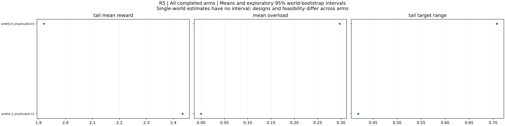

All completed arms: world means and exploratory 95% bootstrap intervals. Single-world arms have no interval. Tail windows contain up to 20 observations. Compare configurations and feasibility before interpreting differences.

### width0.0_amplitude0.03

Exploration shutdown boundary and zero-width commitment control

width0.0_amplitude0.03: 1 runs across 1 worlds. Final Y = 1.68197; final reward = 1.00475; mean overload = 0.297212. Tail target range = 0.707876; observed outcome-settling fraction = 0. Maximum eligible identification error (averaged over worlds) = 8.57758e-13. Some runs overload the budget; raw-Y efficiency comparisons require qualification. This arm has fewer than ten worlds; treat its pattern as exploratory.

Design flags: Zero-width idealization; not the default minimum-freedom model

| Metric | Worlds | Mean | 95% interval |
|---|---:|---:|---|
| initial_Y | 1 | 2.29276 | not estimable to not estimable |
| final_Y | 1 | 1.68197 | not estimable to not estimable |
| final_reward | 1 | 1.00475 | not estimable to not estimable |
| improvement | 1 | -0.610784 | not estimable to not estimable |
| gap_to_best_found | 1 | 0.839946 | not estimable to not estimable |
| settling_period | 0 | not estimable | not estimable to not estimable |
| total_overload | 1 | 3.86375 | not estimable to not estimable |
| skipped_turns | 1 | 0 | not estimable to not estimable |
| jump_events | 1 | 0 | not estimable to not estimable |
| bound_violations | 1 | 0 | not estimable to not estimable |
| tail_target_range | 1 | 0.707876 | not estimable to not estimable |
| target_path_length | 1 | 3.61701 | not estimable to not estimable |
| within_one_percent_best | 1 | 0 | not estimable to not estimable |
| mean_absolute_staleness | 1 | 0.254816 | not estimable to not estimable |
| max_curvature_fit_error | 1 | 6.10345e-13 | not estimable to not estimable |
| max_slope_fit_error | 1 | 8.57758e-13 | not estimable to not estimable |
| max_valid_identification_error | 1 | 8.57758e-13 | not estimable to not estimable |
| max_exploration_formula_error | 1 | 2.96922e-15 | not estimable to not estimable |
| mean_overload | 1 | 0.297212 | not estimable to not estimable |
| overload_period_fraction | 1 | 0.384615 | not estimable to not estimable |
| tail_mean_Y | 1 | 2.21726 | not estimable to not estimable |
| tail_mean_reward | 1 | 1.92005 | not estimable to not estimable |
| tail_price_range | 1 | 1000 | not estimable to not estimable |
| settling_observed | 1 | 0 | not estimable to not estimable |
| skip_fraction | 1 | 0 | not estimable to not estimable |
| eligible_fit_count | 1 | 12 | not estimable to not estimable |
| fit_count | 1 | 12 | not estimable to not estimable |
| max_complementarity_residual | 1 | 1257.5 | not estimable to not estimable |
| final_target_budget_excess | 1 | 0.614294 | not estimable to not estimable |
| final_budget_feasible | 1 | 0 | not estimable to not estimable |
| global_certified | 1 | 0 | not estimable to not estimable |

Configuration: `{"config": {"T": 192, "a_max": 0.03, "beta": 0.7, "budget_rule": "price", "commit": "fixed", "curvature_floor": 0.05, "eps_dis": 0.02, "eta_p": 0.5, "frequencies": "nonresonant", "g0": 1.0, "initial_targets": null, "k": 1, "lambda_overload": 1.0, "log_executions": false, "multistarts": 8, "non_disruption": "draft", "outside_cost_fraction": 0.3, "outside_kind": "none", "outside_local_gain": 0.3, "outside_period": 150, "outside_relocate": false, "outside_role": 0, "outside_scale": 0.4, "p_max": 1000.0, "p_min": 1e-08, "periods": 12, "phi_mem": 1.0, "price_tol": 1e-10, "rho_dis": 0.05, "schedule": "rotation", "theta_adj": 0.3, "w_min": 0.0, "within_period": "fixed"}, "world": {"alpha_max": 0.3, "budget_factor": 1.0, "n": 5, "s_off": 0.4, "scenario": "frustrated"}}`

### width0.3_amplitude0.15

Exploration shutdown boundary and zero-width commitment control

width0.3_amplitude0.15: 1 runs across 1 worlds. Final Y = 2.51281; final reward = 2.51281; mean overload = 0. Tail target range = 0.419059; observed outcome-settling fraction = 0. Maximum eligible identification error (averaged over worlds) = 9.37028e-14. This arm has fewer than ten worlds; treat its pattern as exploratory.

Design flags: none

| Metric | Worlds | Mean | 95% interval |
|---|---:|---:|---|
| initial_Y | 1 | 2.29276 | not estimable to not estimable |
| final_Y | 1 | 2.51281 | not estimable to not estimable |
| final_reward | 1 | 2.51281 | not estimable to not estimable |
| improvement | 1 | 0.220048 | not estimable to not estimable |
| gap_to_best_found | 1 | 0.00911521 | not estimable to not estimable |
| settling_period | 0 | not estimable | not estimable to not estimable |
| total_overload | 1 | 0 | not estimable to not estimable |
| skipped_turns | 1 | 0 | not estimable to not estimable |
| jump_events | 1 | 0 | not estimable to not estimable |
| bound_violations | 1 | 0 | not estimable to not estimable |
| tail_target_range | 1 | 0.419059 | not estimable to not estimable |
| target_path_length | 1 | 0.934363 | not estimable to not estimable |
| within_one_percent_best | 1 | 1 | not estimable to not estimable |
| mean_absolute_staleness | 1 | 0.181769 | not estimable to not estimable |
| max_curvature_fit_error | 1 | 6.81122e-14 | not estimable to not estimable |
| max_slope_fit_error | 1 | 9.37028e-14 | not estimable to not estimable |
| max_valid_identification_error | 1 | 9.37028e-14 | not estimable to not estimable |
| max_exploration_formula_error | 1 | 5.30218e-15 | not estimable to not estimable |
| mean_overload | 1 | 0 | not estimable to not estimable |
| overload_period_fraction | 1 | 0 | not estimable to not estimable |
| tail_mean_Y | 1 | 2.43382 | not estimable to not estimable |
| tail_mean_reward | 1 | 2.43382 | not estimable to not estimable |
| tail_price_range | 1 | 0.134069 | not estimable to not estimable |
| settling_observed | 1 | 0 | not estimable to not estimable |
| skip_fraction | 1 | 0 | not estimable to not estimable |
| eligible_fit_count | 1 | 12 | not estimable to not estimable |
| fit_count | 1 | 12 | not estimable to not estimable |
| max_complementarity_residual | 1 | 2.22664e-10 | not estimable to not estimable |
| final_target_budget_excess | 1 | 0 | not estimable to not estimable |
| final_budget_feasible | 1 | 1 | not estimable to not estimable |
| global_certified | 1 | 0 | not estimable to not estimable |

Configuration: `{"config": {"T": 192, "a_max": 0.15, "beta": 0.7, "budget_rule": "price", "commit": "fixed", "curvature_floor": 0.05, "eps_dis": 0.02, "eta_p": 0.5, "frequencies": "nonresonant", "g0": 1.0, "initial_targets": null, "k": 1, "lambda_overload": 1.0, "log_executions": false, "multistarts": 8, "non_disruption": "draft", "outside_cost_fraction": 0.3, "outside_kind": "none", "outside_local_gain": 0.3, "outside_period": 150, "outside_relocate": false, "outside_role": 0, "outside_scale": 0.4, "p_max": 1000.0, "p_min": 1e-08, "periods": 12, "phi_mem": 1.0, "price_tol": 1e-10, "rho_dis": 0.05, "schedule": "rotation", "theta_adj": 0.3, "w_min": 0.3, "within_period": "fixed"}, "world": {"alpha_max": 0.3, "budget_factor": 1.0, "n": 5, "s_off": 0.4, "scenario": "frustrated"}}`

## R6 — results and interpretation

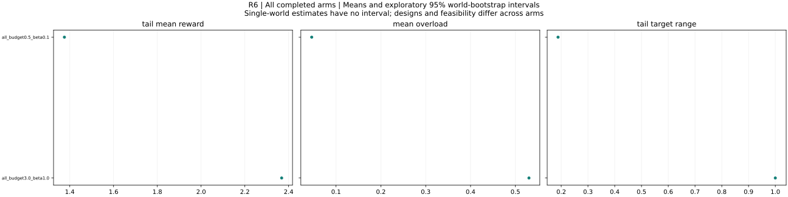

All completed arms: world means and exploratory 95% bootstrap intervals. Single-world arms have no interval. Tail windows contain up to 20 observations. Compare configurations and feasibility before interpreting differences.

### all_budget0.5_beta0.1

No free price-responsive functions: slack price versus overload

all_budget0.5_beta0.1: 1 runs across 1 worlds. Final Y = 1.519; final reward = 1.519; mean overload = 0.0457608. Tail target range = 0.188255; observed outcome-settling fraction = 0. Maximum eligible identification error (averaged over worlds) = 1.85907e-13. Some runs overload the budget; raw-Y efficiency comparisons require qualification. This arm has fewer than ten worlds; treat its pattern as exploratory.

Design flags: During all-explorer periods price cannot adjust any free setting

| Metric | Worlds | Mean | 95% interval |
|---|---:|---:|---|
| initial_Y | 1 | 1.31971 | not estimable to not estimable |
| final_Y | 1 | 1.519 | not estimable to not estimable |
| final_reward | 1 | 1.519 | not estimable to not estimable |
| improvement | 1 | 0.199292 | not estimable to not estimable |
| gap_to_best_found | 1 | 0.0339352 | not estimable to not estimable |
| settling_period | 0 | not estimable | not estimable to not estimable |
| total_overload | 1 | 0.59489 | not estimable to not estimable |
| skipped_turns | 1 | 20 | not estimable to not estimable |
| jump_events | 1 | 0 | not estimable to not estimable |
| bound_violations | 1 | 0 | not estimable to not estimable |
| tail_target_range | 1 | 0.188255 | not estimable to not estimable |
| target_path_length | 1 | 0.904056 | not estimable to not estimable |
| within_one_percent_best | 1 | 0 | not estimable to not estimable |
| mean_absolute_staleness | 1 | 0.0792486 | not estimable to not estimable |
| max_curvature_fit_error | 1 | 1.85907e-13 | not estimable to not estimable |
| max_slope_fit_error | 1 | 1.25344e-13 | not estimable to not estimable |
| max_valid_identification_error | 1 | 1.85907e-13 | not estimable to not estimable |
| max_exploration_formula_error | 1 | 1.67363e-15 | not estimable to not estimable |
| mean_overload | 1 | 0.0457608 | not estimable to not estimable |
| overload_period_fraction | 1 | 0.307692 | not estimable to not estimable |
| tail_mean_Y | 1 | 1.42121 | not estimable to not estimable |
| tail_mean_reward | 1 | 1.37545 | not estimable to not estimable |
| tail_price_range | 1 | 1000 | not estimable to not estimable |
| settling_observed | 1 | 0 | not estimable to not estimable |
| skip_fraction | 1 | 0.333333 | not estimable to not estimable |
| eligible_fit_count | 1 | 40 | not estimable to not estimable |
| fit_count | 1 | 40 | not estimable to not estimable |
| max_complementarity_residual | 1 | 364.664 | not estimable to not estimable |
| final_target_budget_excess | 1 | 0.0554107 | not estimable to not estimable |
| final_budget_feasible | 1 | 1 | not estimable to not estimable |
| global_certified | 1 | 0 | not estimable to not estimable |

Configuration: `{"config": {"T": 192, "a_max": 0.08, "beta": 0.1, "budget_rule": "price", "commit": "fixed", "curvature_floor": 0.05, "eps_dis": 0.02, "eta_p": 0.5, "frequencies": "nonresonant", "g0": 1.0, "initial_targets": null, "k": 5, "lambda_overload": 1.0, "log_executions": false, "multistarts": 8, "non_disruption": "draft", "outside_cost_fraction": 0.3, "outside_kind": "none", "outside_local_gain": 0.3, "outside_period": 150, "outside_relocate": false, "outside_role": 0, "outside_scale": 0.4, "p_max": 1000.0, "p_min": 1e-08, "periods": 12, "phi_mem": 1.0, "price_tol": 1e-10, "rho_dis": 0.05, "schedule": "all", "theta_adj": 0.3, "w_min": 0.1, "within_period": "fixed"}, "world": {"alpha_max": 0.3, "budget_factor": 0.5, "n": 5, "s_off": 0.4, "scenario": "frustrated"}}`

### all_budget3.0_beta1.0

No free price-responsive functions: slack price versus overload

all_budget3.0_beta1.0: 1 runs across 1 worlds. Final Y = 3.57827; final reward = 3.57827; mean overload = 0.530209. Tail target range = 0.999999; observed outcome-settling fraction = 0. Maximum eligible identification error (averaged over worlds) = 8.4599e-13. Some runs overload the budget; raw-Y efficiency comparisons require qualification. This arm has fewer than ten worlds; treat its pattern as exploratory.

Design flags: During all-explorer periods price cannot adjust any free setting

| Metric | Worlds | Mean | 95% interval |
|---|---:|---:|---|
| initial_Y | 1 | 3.73899 | not estimable to not estimable |
| final_Y | 1 | 3.57827 | not estimable to not estimable |
| final_reward | 1 | 3.57827 | not estimable to not estimable |
| improvement | 1 | -0.160713 | not estimable to not estimable |
| gap_to_best_found | 1 | 0.283168 | not estimable to not estimable |
| settling_period | 0 | not estimable | not estimable to not estimable |
| total_overload | 1 | 6.89272 | not estimable to not estimable |
| skipped_turns | 1 | 12 | not estimable to not estimable |
| jump_events | 1 | 0 | not estimable to not estimable |
| bound_violations | 1 | 0 | not estimable to not estimable |
| tail_target_range | 1 | 0.999999 | not estimable to not estimable |
| target_path_length | 1 | 14.3399 | not estimable to not estimable |
| within_one_percent_best | 1 | 0 | not estimable to not estimable |
| mean_absolute_staleness | 1 | 0.651875 | not estimable to not estimable |
| max_curvature_fit_error | 1 | 4.47864e-13 | not estimable to not estimable |
| max_slope_fit_error | 1 | 8.4599e-13 | not estimable to not estimable |
| max_valid_identification_error | 1 | 8.4599e-13 | not estimable to not estimable |
| max_exploration_formula_error | 1 | 8.80074e-15 | not estimable to not estimable |
| mean_overload | 1 | 0.530209 | not estimable to not estimable |
| overload_period_fraction | 1 | 0.230769 | not estimable to not estimable |
| tail_mean_Y | 1 | 2.89831 | not estimable to not estimable |
| tail_mean_reward | 1 | 2.3681 | not estimable to not estimable |
| tail_price_range | 1 | 1000 | not estimable to not estimable |
| settling_observed | 1 | 0 | not estimable to not estimable |
| skip_fraction | 1 | 0.2 | not estimable to not estimable |
| eligible_fit_count | 1 | 48 | not estimable to not estimable |
| fit_count | 1 | 48 | not estimable to not estimable |
| max_complementarity_residual | 1 | 2516.9 | not estimable to not estimable |
| final_target_budget_excess | 1 | 48.49 | not estimable to not estimable |
| final_budget_feasible | 1 | 1 | not estimable to not estimable |
| global_certified | 1 | 0 | not estimable to not estimable |

Configuration: `{"config": {"T": 192, "a_max": 0.08, "beta": 1.0, "budget_rule": "price", "commit": "fixed", "curvature_floor": 0.05, "eps_dis": 0.02, "eta_p": 0.5, "frequencies": "nonresonant", "g0": 1.0, "initial_targets": null, "k": 5, "lambda_overload": 1.0, "log_executions": false, "multistarts": 8, "non_disruption": "draft", "outside_cost_fraction": 0.3, "outside_kind": "none", "outside_local_gain": 0.3, "outside_period": 150, "outside_relocate": false, "outside_role": 0, "outside_scale": 0.4, "p_max": 1000.0, "p_min": 1e-08, "periods": 12, "phi_mem": 1.0, "price_tol": 1e-10, "rho_dis": 0.05, "schedule": "all", "theta_adj": 0.3, "w_min": 0.1, "within_period": "fixed"}, "world": {"alpha_max": 0.3, "budget_factor": 3.0, "n": 5, "s_off": 0.4, "scenario": "frustrated"}}`

## Explicit planned comparisons

[
  {
    "family": "E7",
    "reference": "fixed",
    "treatment": "adaptive_exact",
    "metric": "tail_mean_reward",
    "changed_parameters": "config.within_period",
    "status": "estimated",
    "matched_worlds": 1,
    "reference_worlds": 1,
    "treatment_worlds": 1,
    "n": 1,
    "mean": -0.11161909579536955,
    "median": -0.11161909579536955,
    "sd": null,
    "min": -0.11161909579536955,
    "max": -0.11161909579536955,
    "ci95_low": null,
    "ci95_high": null
  },
  {
    "family": "E7",
    "reference": "fixed",
    "treatment": "adaptive_theta0.3",
    "metric": "mean_overload",
    "changed_parameters": "",
    "status": "not estimable: missing arms or eligible observations",
    "matched_worlds": 0,
    "reference_worlds": 1,
    "treatment_worlds": 0,
    "n": 0,
    "mean": null,
    "median": null,
    "sd": null,
    "min": null,
    "max": null,
    "ci95_low": null,
    "ci95_high": null
  },
  {
    "family": "E3",
    "reference": "k5_nonresonant",
    "treatment": "k5_resonant",
    "metric": "max_curvature_fit_error",
    "changed_parameters": "",
    "status": "not estimable: missing arms or eligible observations",
    "matched_worlds": 0,
    "reference_worlds": 0,
    "treatment_worlds": 1,
    "n": 0,
    "mean": null,
    "median": null,
    "sd": null,
    "min": null,
    "max": null,
    "ci95_low": null,
    "ci95_high": null
  },
  {
    "family": "R2",
    "reference": "price_fixed",
    "treatment": "ration_fixed",
    "metric": "mean_overload",
    "changed_parameters": "",
    "status": "not estimable: missing arms or eligible observations",
    "matched_worlds": 0,
    "reference_worlds": 1,
    "treatment_worlds": 0,
    "n": 0,
    "mean": null,
    "median": null,
    "sd": null,
    "min": null,
    "max": null,
    "ci95_low": null,
    "ci95_high": null
  },
  {
    "family": "R2",
    "reference": "price_fixed",
    "treatment": "price_adaptive",
    "metric": "tail_target_range",
    "changed_parameters": "",
    "status": "not estimable: missing arms or eligible observations",
    "matched_worlds": 0,
    "reference_worlds": 1,
    "treatment_worlds": 0,
    "n": 0,
    "mean": null,
    "median": null,
    "sd": null,
    "min": null,
    "max": null,
    "ci95_low": null,
    "ci95_high": null
  }
]

## Complete run appendix

- [E1/k1_beta0.3_width0.02_budget1.0/0/0](runs/run-d6ecfe76615515c7.html)
- [E1/k5_beta1.0_width0.2_budget3.0/0/0](runs/run-4f707a9226a77650.html)
- [E10/n12/0/0](runs/run-8ec6df0197c8026d.html)
- [E10/n3/0/0](runs/run-53d0324377a204fd.html)
- [E11/budget0.5/0/0](runs/run-bd5f7d5d513b37b5.html)
- [E11/budget3.0/0/0](runs/run-8744fe81ca6146dd.html)
- [E12/interference_right/0/0](runs/run-f2939a8a9c1bba7f.html)
- [E12/linear/0/0](runs/run-c4566246a108d727.html)
- [E2/frustrated_prior0.5_alpha0.0/0/0](runs/run-7039a310d02cebae.html)
- [E2/interference_prior2.0_alpha0.6/0/0](runs/run-26d1e1738aaee7c3.html)
- [E3/k1_nonresonant/0/0](runs/run-9875df55f0b7fa78.html)
- [E3/k5_resonant/0/0](runs/run-8f4b7233c9aced10.html)
- [E4/tolerance0.005_amplitude0.03/0/0](runs/run-0da58f8fee3d8c03.html)
- [E4/tolerance0.05_amplitude0.15/0/0](runs/run-74313ae66706481b.html)
- [E5/alpha0.0_width0.02_reviewedFalse/0/0](runs/run-132b57bad8acfe7a.html)
- [E5/alpha0.6_width0.3_reviewedTrue/0/0](runs/run-0322cdba32b0034a.html)
- [E6/interaction0.1_k1_memory0.5/0/0](runs/run-583a52b561f35b11.html)
- [E6/interaction0.8_k5_memory1.0/0/0](runs/run-506955f08b67bab7.html)
- [E7/adaptive_exact/0/0](runs/run-a17a424275b59812.html)
- [E7/fixed/0/0](runs/run-876c0303f4a691c4.html)
- [E8/concave/0/0](runs/run-0f66549dd07e7c92.html)
- [E8/frustrated/0/0](runs/run-0cc4bc09697b58e8.html)
- [E9/invisible_with_relocation/0/0](runs/run-4276bdb822b0736f.html)
- [E9/random_k1/0/0](runs/run-c7c7ced2ba20afac.html)
- [R1/all_k5/0/0](runs/run-0caa790d51203e99.html)
- [R1/rotation_k1/0/0](runs/run-4c2231fde58df90c.html)
- [R2/price_fixed/0/0](runs/run-aa458ab44bde81b1.html)
- [R2/ration_adaptive/0/0](runs/run-345585e30b6d848c.html)
- [R3/eta0.1_theta0.1/0/0](runs/run-9978eab86369b5b5.html)
- [R3/eta1.0_theta1.0/0/0](runs/run-781041436ff74454.html)
- [R4/offset-5.0_draft/0/0](runs/run-387a4bca79b835cd.html)
- [R4/offset5.0_absolute_drop/0/0](runs/run-8f2e951974fa0e6f.html)
- [R5/width0.0_amplitude0.03/0/0](runs/run-10e56be1f021f1a1.html)
- [R5/width0.3_amplitude0.15/0/0](runs/run-c8a2c56deefa00f5.html)
- [R6/all_budget0.5_beta0.1/0/0](runs/run-7aa24192279cd10c.html)
- [R6/all_budget3.0_beta1.0/0/0](runs/run-f888534fca4347ee.html)

## Metric dictionary

- **final_Y**: Raw mean aggregate in the final period; may include infeasible executions.
- **final_reward**: Final aggregate minus the configured overload penalty.
- **improvement**: Final raw aggregate minus period-zero raw aggregate; not a causal treatment effect.
- **gap_to_best_found**: Feasible team best-found minus final raw aggregate. Negative values may reflect overload.
- **total_overload**: Sum of per-period overload; horizon dependent. Fixed periods use average-budget overload; adaptive periods average positive execution overload.
- **mean_overload**: Mean overload across all logged periods, including period zero.
- **overload_period_fraction**: Fraction of logged periods with overload above 1e-8.
- **tail_mean_Y**: Mean raw aggregate across the last min(20, number of observations) periods.
- **tail_mean_reward**: Mean penalized reward over the same final window.
- **tail_target_range**: Largest coordinate range over the last up to 20 periods. Finite-horizon motion diagnostic.
- **tail_price_range**: Maximum minus minimum price over the final up to 20 periods.
- **settling_period**: First period of a suffix of at least 20 observations within 1% of final Y. Null means not observed; conditional means exclude censored runs.
- **settling_observed**: 1 if the outcome settling criterion was observed, 0 otherwise; not a setting-convergence test.
- **skipped_turns**: Number of scheduled function turns not executed.
- **skip_fraction**: Skipped function turns / scheduled function turns; null if none scheduled.
- **jump_events**: Number of logged fast-game jump events.
- **bound_violations**: Number of execution-coordinate commitment-bound violations.
- **target_path_length**: Sum of Euclidean target displacements between periods.
- **mean_absolute_staleness**: Mean absolute local-slope belief error over functions and periods, including initial priors.
- **max_valid_identification_error**: Maximum absolute fitted slope/curvature error only on updates satisfying logged exact-identification conditions; null if no eligible fits.
- **eligible_fit_count**: Number of updates satisfying exact-identification conditions.
- **fit_count**: Number of successful local regression updates.
- **max_curvature_fit_error**: Largest absolute curvature-fit error over all updates, whether or not exact premises hold.
- **max_slope_fit_error**: Largest absolute slope-fit error over all updates.
- **max_exploration_formula_error**: Largest exploration-effect prediction error over periods with logged applicability.
- **max_complementarity_residual**: Largest logged resource price/complementarity residual.
- **final_target_budget_excess**: Positive part of final target spending minus the final world budget.
- **final_budget_feasible**: 1 if final logged mean spending is within budget +1e-8; average-feasibility diagnostic only.
- **within_one_percent_best**: Raw final Y within 1% of best-found Y; interpret jointly with feasibility.
- **global_certified**: 1 if final team benchmark carries the solver global-certification flag.
- **initial_Y**: Period-zero raw aggregate.
